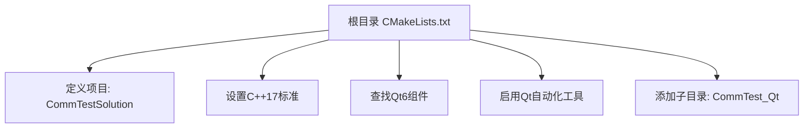
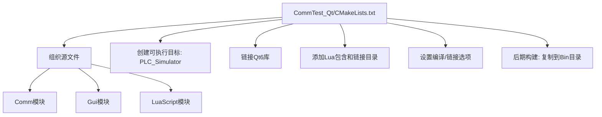
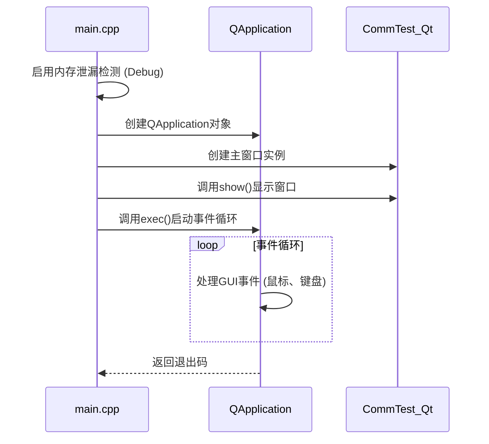

# 快速入门指南

<cite>
**Referenced Files in This Document**   
- [CMakeLists.txt](file://CMakeLists.txt)
- [CommTest_Qt/CMakeLists.txt](file://CommTest_Qt/CMakeLists.txt)
- [CommTest_Qt/main.cpp](file://CommTest_Qt/main.cpp)
- [CommTest_Qt/MemoryLeakDetector.h](file://CommTest_Qt/MemoryLeakDetector.h)
- [VS2022项目迁移CMake.md](file://VS2022项目迁移CMake.md)
</cite>

## 目录
1. [简介](#简介)
2. [环境准备](#环境准备)
3. [构建系统配置](#构建系统配置)
4. [编译与运行](#编译与运行)
5. [程序入口与执行流程](#程序入口与执行流程)
6. [常见问题排查](#常见问题排查)
7. [总结](#总结)

## 简介

本指南旨在为初学者提供一份详尽的快速入门教程，帮助您成功搭建CommTest_Qt_CMake项目的开发环境并完成首次编译运行。该项目是一个基于Qt6框架的C++应用程序，利用CMake作为构建系统，并集成了Lua脚本功能。通过本指南，您将学习如何安装必要的依赖项、配置CMake构建系统、理解项目结构，并最终成功运行程序。

**Section sources**
- [VS2022项目迁移CMake.md](file://VS2022项目迁移CMake.md#L1-L417)

## 环境准备

在开始构建项目之前，您需要确保系统中已安装以下核心依赖项。

### 安装CMake

CMake是本项目的核心构建工具。请确保安装版本不低于3.16。

1.  访问[CMake官方网站](https://cmake.org/)下载最新版本的安装程序。
2.  运行安装程序，并在安装过程中勾选“Add CMake to the system PATH for all users”选项，以便在命令行中直接使用`cmake`命令。
3.  安装完成后，打开命令提示符（CMD）或PowerShell，输入以下命令验证安装：
    ```bash
    cmake --version
    ```
    如果正确显示了CMake的版本号（如`cmake version 3.27.7`），则表示安装成功。

**Section sources**
- [VS2022项目迁移CMake.md](file://VS2022项目迁移CMake.md#L17-L25)

### 安装Qt6

本项目依赖Qt6框架进行GUI开发。

1.  访问[Qt官方网站](https://www.qt.io/)并下载Qt在线安装程序。
2.  在安装过程中，选择一个Qt6的版本（例如6.5.0或更高版本）。
3.  **关键步骤**：在组件选择界面，确保勾选了以下模块：
    *   `Qt Core`
    *   `Qt Gui`
    *   `Qt Widgets`
    *   `Qt Network`
    *   `Qt SerialPort`
4.  完成安装。CMake将通过`find_package(Qt6 REQUIRED COMPONENTS ...)`命令自动定位Qt的安装路径。

**Section sources**
- [CMakeLists.txt](file://CMakeLists.txt#L24-L25)

### Lua库

项目中集成了Lua脚本功能，所需的Lua头文件和库文件已包含在项目内。

*   **头文件**: 位于项目根目录下的`Lua/Include/`文件夹中。
*   **库文件**: 项目期望在`Lua/Lib/`目录下找到`ScriptRunner.lib`。根据文件检索结果，该库文件可能需要您自行编译或从其他途径获取。

**Section sources**
- [CommTest_Qt/CMakeLists.txt](file://CommTest_Qt/CMakeLists.txt#L162-L167)
- [Lua/Include](file://Lua/Include)

## 构建系统配置

本项目采用分层的CMakeLists.txt文件结构来管理构建过程。

### 根目录 CMakeLists.txt

位于项目根目录的`CMakeLists.txt`文件是整个构建过程的起点。

*   **最低版本要求**: `cmake_minimum_required(VERSION 3.16)` 确保了构建环境的兼容性。
*   **项目定义**: `project(CommTestSolution VERSION 1.0.0 LANGUAGES CXX)` 定义了项目名称和使用的语言。
*   **C++标准**: `set(CMAKE_CXX_STANDARD 17)` 强制要求编译器使用C++17标准。
*   **输出目录**: 配置了`CMAKE_RUNTIME_OUTPUT_DIRECTORY`等变量，将生成的可执行文件统一输出到`build/Temp/CommTestSolution/bin/`目录下。
*   **Qt集成**: `find_package(Qt6 REQUIRED COMPONENTS Core Gui Widgets Network SerialPort)` 命令用于查找并链接Qt6库。`REQUIRED`关键字确保如果Qt未找到，配置过程将立即失败。
*   **自动化工具**: `set(CMAKE_AUTOMOC ON)`等命令启用了Qt的MOC、UIC和RCC工具的自动调用，简化了构建流程。
*   **子项目引入**: `add_subdirectory(CommTest_Qt)` 命令将`CommTest_Qt`子目录作为另一个CMake项目进行处理。



**Diagram sources**
- [CMakeLists.txt](file://CMakeLists.txt#L1-L50)

**Section sources**
- [CMakeLists.txt](file://CMakeLists.txt#L1-L50)

### 子项目 CMakeLists.txt

位于`CommTest_Qt/`目录下的`CMakeLists.txt`文件负责配置最终的可执行文件。

*   **目标名称**: `set(TARGET_NAME "PLC_Simulator")` 定义了可执行文件的基本名称。
*   **源文件组织**: 使用`set()`命令将不同模块（如Comm、Gui、LuaScript）的源文件和头文件分组，便于管理。
*   **创建可执行文件**: `add_executable(${TARGET_NAME} ...)` 命令将所有源文件、头文件、资源文件（`.qrc`）和UI文件（`.ui`）聚合，创建名为`PLC_Simulator`的可执行目标。
*   **链接Qt库**: `target_link_libraries()` 命令将Qt6的各个模块（Core, Gui, Widgets等）链接到目标。
*   **包含目录**: `target_include_directories()` 命令添加了项目内各模块以及外部Lua头文件的搜索路径。
*   **链接Lua库**: `target_link_directories()` 和 `target_link_libraries()` 命令指定了Lua库文件的路径和具体的库名（`ScriptRunner.lib`）。
*   **编译与链接选项**: 设置了与原VS2022项目一致的编译选项（如`/MDd`用于Debug）和链接选项（如`/SUBSYSTEM:WINDOWS`以隐藏控制台窗口）。
*   **后期构建步骤**: `add_custom_command()` 命令在编译成功后，自动将生成的可执行文件复制到`Bin/x64/`目录。



**Diagram sources**
- [CommTest_Qt/CMakeLists.txt](file://CommTest_Qt/CMakeLists.txt#L1-L198)

**Section sources**
- [CommTest_Qt/CMakeLists.txt](file://CommTest_Qt/CMakeLists.txt#L1-L198)

## 编译与运行

完成环境配置后，即可开始构建项目。

### 生成Visual Studio解决方案

1.  打开命令行工具（如CMD、PowerShell或Git Bash），并导航至项目根目录。
2.  执行以下命令来生成Visual Studio 2022的解决方案文件：
    ```bash
    cmake -S . -B build -G "Visual Studio 17 2022" -A x64
    ```
    *   `-S .`: 指定源代码目录为当前目录。
    *   `-B build`: 指定构建目录为`build`（如果不存在会自动创建）。
    *   `-G "Visual Studio 17 2022"`: 指定生成器为Visual Studio 2022。如果使用其他版本，请相应调整（如`"Visual Studio 16 2019"`）。
    *   `-A x64`: 指定目标架构为x64。
3.  如果一切顺利，您将在`build`目录下看到生成的`CommTestSolution.sln`文件。

**Section sources**
- [VS2022项目迁移CMake.md](file://VS2022项目迁移CMake.md#L400-L402)

### 编译项目

1.  使用Visual Studio 2022打开`build/CommTestSolution.sln`文件。
2.  在Visual Studio中，选择正确的配置（Debug或Release）和平台（x64）。
3.  右键点击`PLC_Simulator`项目，选择“设为启动项目”。
4.  按下`F7`键或点击“生成”菜单中的“生成解决方案”来编译整个项目。

### 运行程序

编译成功后，您可以直接在Visual Studio中按下`Ctrl+F5`（不调试运行）或`F5`（调试运行）来启动程序。根据`CMakeLists.txt`中的后期构建步骤，可执行文件也会被自动复制到项目根目录下的`Bin/x64/`文件夹中，您也可以直接双击该文件运行。

## 程序入口与执行流程

`main.cpp`文件是整个程序的入口点。

1.  **内存泄漏检测 (仅Debug)**: 在Windows的Debug模式下，程序首先调用`MemoryLeakDetector::EnableMemoryLeakChecks()`来启用运行时内存泄漏检测。
2.  **创建应用对象**: `QApplication app(argc, argv);` 创建了Qt应用程序的核心对象，负责管理GUI事件和应用程序的生命周期。
3.  **创建主窗口**: `CommTest_Qt window;` 创建了主窗口类的实例。
4.  **显示窗口**: `window.show();` 将主窗口显示在屏幕上。
5.  **进入事件循环**: `return app.exec();` 启动Qt的事件循环，程序开始响应用户的鼠标、键盘等操作，直到窗口被关闭。



**Diagram sources**
- [CommTest_Qt/main.cpp](file://CommTest_Qt/main.cpp#L11-L30)
- [CommTest_Qt/MemoryLeakDetector.h](file://CommTest_Qt/MemoryLeakDetector.h#L16-L61)

**Section sources**
- [CommTest_Qt/main.cpp](file://CommTest_Qt/main.cpp#L11-L30)

## 常见问题排查

在构建过程中，您可能会遇到以下问题：

### Qt未找到

*   **现象**: CMake配置时出现`Could NOT find Qt6`错误。
*   **原因**: CMake无法定位Qt6的安装路径。
*   **解决方案**: 
    1.  确认Qt6已正确安装，并且安装了`CMake`组件。
    2.  在运行`cmake`命令时，通过`-DCMAKE_PREFIX_PATH`参数手动指定Qt6的安装路径，例如：
        ```bash
        cmake -S . -B build -DCMAKE_PREFIX_PATH="C:/Qt/6.5.0/msvc2019_64"
        ```

### Lua头文件或库文件路径错误

*   **现象**: 编译时出现`lua.h: No such file or directory`或`无法解析的外部符号`等链接错误。
*   **原因**: `target_include_directories`或`target_link_directories`指定的路径不正确，或`ScriptRunner.lib`文件缺失。
*   **解决方案**:
    1.  检查`CommTest_Qt/CMakeLists.txt`中`target_include_directories`的路径是否为`${CMAKE_SOURCE_DIR}/Lua/Include`。
    2.  确认`Lua/Include`目录下存在`lua.h`等头文件。
    3.  确认`Lua/Lib`目录下存在`ScriptRunner.lib`文件。如果不存在，您需要自行编译Lua库或获取该文件。

**Section sources**
- [CommTest_Qt/CMakeLists.txt](file://CommTest_Qt/CMakeLists.txt#L152-L172)

## 总结

通过本指南，您已经完成了CommTest_Qt_CMake项目的环境搭建、构建配置和首次运行。您学习了如何利用CMake这一跨平台构建工具来管理复杂的C++项目，并理解了其与Qt框架和第三方库（Lua）的集成方式。现在，您可以基于此环境开始探索和开发项目功能。