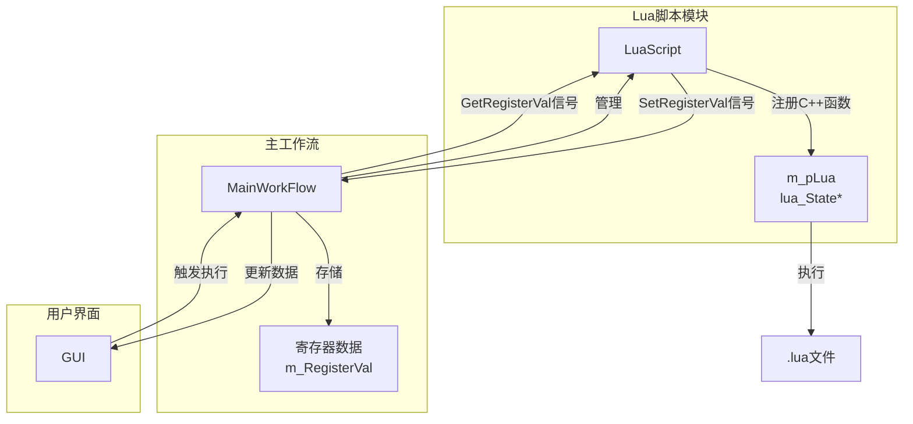
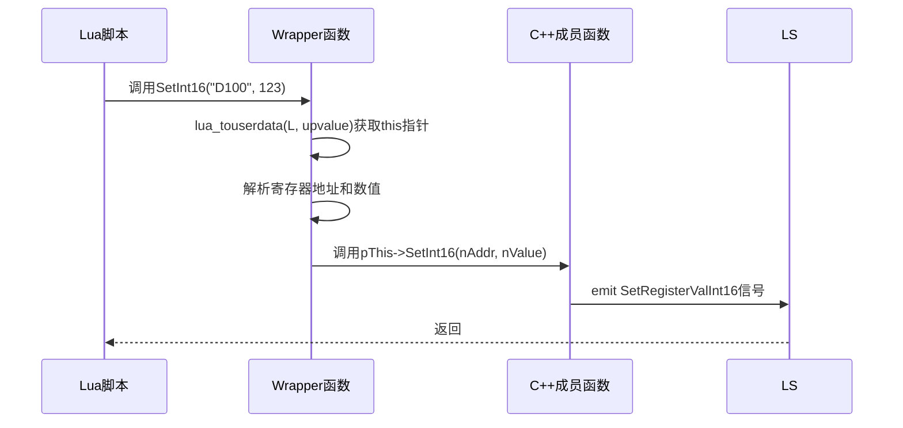
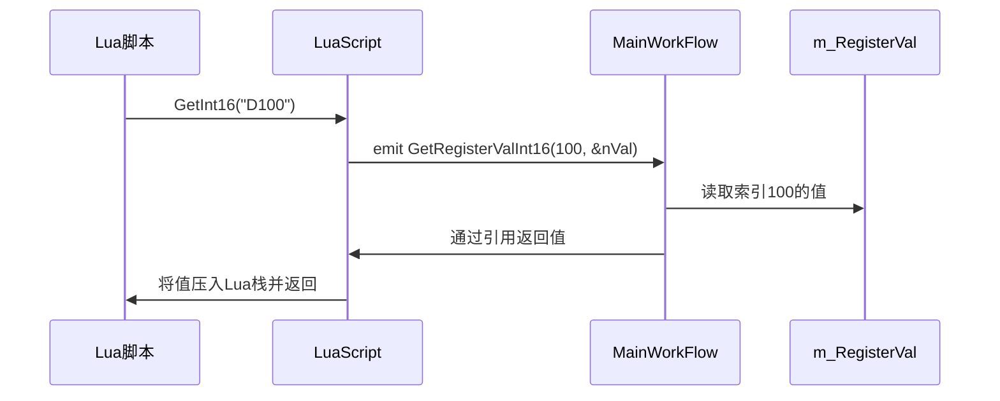
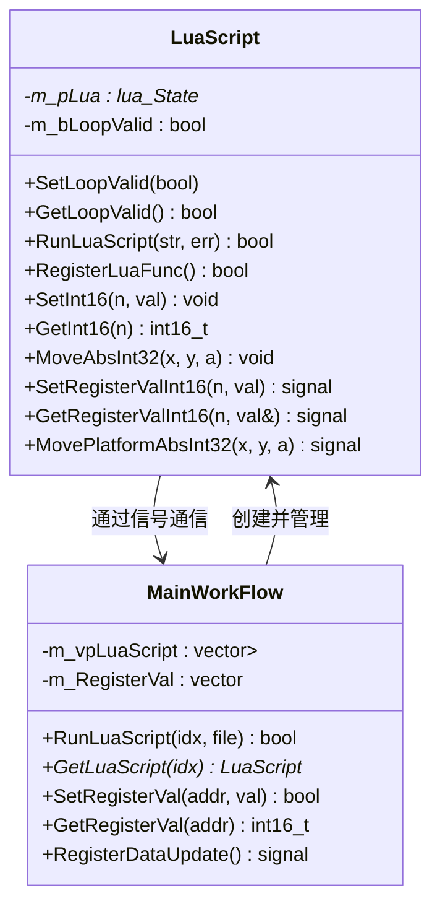

# Lua脚本模块设计

<cite>
**本文档引用的文件**   
- [LuaScript.h](file://CommTest_Qt\LuaScript\LuaScript.h)
- [LuaScript.cpp](file://CommTest_Qt\LuaScript\LuaScript.cpp)
- [MainWorkFlow.h](file://CommTest_Qt\MainFlow\MainWorkFlow.h)
- [MainWorkFlow.cpp](file://CommTest_Qt\MainFlow\MainWorkFlow.cpp)
</cite>

## 目录
1. [项目结构](#项目结构)
2. [核心组件](#核心组件)
3. [架构概述](#架构概述)
4. [详细组件分析](#详细组件分析)
5. [依赖分析](#依赖分析)

## 项目结构

根据项目目录结构，Lua脚本模块位于`CommTest_Qt/LuaScript/`目录下，包含`LuaScript.h`和`LuaScript.cpp`两个核心文件。该模块依赖于外部的Lua库头文件（位于`Lua/Include/`目录），并通过Qt的信号与槽机制与主工作流`MainWorkFlow`进行交互。主工作流模块位于`CommTest_Qt/MainFlow/`目录下，负责管理多个Lua脚本实例并协调其与通信协议、寄存器数据的交互。

## 核心组件

`LuaScript`类是本模块的核心，它封装了Lua虚拟机（`lua_State*`），为上层应用提供了执行Lua脚本的能力。该类通过静态方法`InitialLuaScript`进行初始化，并禁用了拷贝构造和赋值操作，确保了实例的唯一性和安全性。其主要职责包括：
- 管理一个独立的Lua执行环境（`m_pLua`）。
- 将C++的寄存器读写和平台控制功能注册为Lua的全局函数。
- 提供执行外部`.lua`文件或编辑器内联脚本的接口。
- 通过Qt信号与主工作流通信，实现数据的双向同步。

**本节来源**
- [LuaScript.h](file://CommTest_Qt\LuaScript\LuaScript.h#L7-L141)
- [LuaScript.cpp](file://CommTest_Qt\LuaScript\LuaScript.cpp#L5-L11)

## 架构概述

**图示来源**
- [LuaScript.h](file://CommTest_Qt\LuaScript\LuaScript.h#L36)
- [MainWorkFlow.h](file://CommTest_Qt\MainFlow\MainWorkFlow.h#L87)
- [MainWorkFlow.h](file://CommTest_Qt\MainFlow\MainWorkFlow.h#L94)

## 详细组件分析

### LuaScript类分析

`LuaScript`类通过一系列精心设计的机制，实现了C++与Lua的无缝集成。

#### C++函数到Lua的注册机制
`LuaScript`类通过`RegisterLuaFunc`方法，利用Lua C API将一系列C++成员函数注册为Lua的全局函数。其核心是使用`lua_pushlightuserdata`将`this`指针作为上值（upvalue）压入栈，然后通过`lua_pushcclosure`创建一个闭包。当Lua调用这些全局函数时，闭包中的C函数（即`Wrapper`函数）能够通过`lua_upvalueindex(1)`获取到原始的`this`指针，从而调用正确的C++对象实例。

**图示来源**
- [LuaScript.cpp](file://CommTest_Qt\LuaScript\LuaScript.cpp#L67-L132)
- [LuaScript.cpp](file://CommTest_Qt\LuaScript\LuaScript.cpp#L134-L160)
- [LuaScript.h](file://CommTest_Qt\LuaScript\LuaScript.h#L69)

#### 静态包装器函数的作用
`SetInt16Wrapper`等静态包装器函数是连接Lua C API和C++成员函数的桥梁。它们遵循Lua C函数的标准签名`int func(lua_State* L)`。其主要工作流程如下：
1.  **获取`this`指针**：通过`lua_upvalueindex(1)`从闭包的上值中获取`LuaScript`实例的指针。
2.  **参数校验与解析**：检查Lua传入的参数类型（如`lua_isstring`），并使用`luaL_checkinteger`或`luaL_checknumber`安全地获取参数值。对于寄存器地址，会调用`ParseRegisterAddr`进行格式验证和解析。
3.  **调用实际函数**：在完成参数校验后，调用对应的C++成员函数（如`pThis->SetInt16`）。
4.  **返回结果**：根据函数类型，返回需要保留在Lua栈上的值的数量（例如，`Set`系列函数返回0，`Get`系列函数返回1）。

**本节来源**
- [LuaScript.cpp](file://CommTest_Qt\LuaScript\LuaScript.cpp#L134-L160)
- [LuaScript.cpp](file://CommTest_Qt\LuaScript\LuaScript.cpp#L298-L317)
- [LuaScript.h](file://CommTest_Qt\LuaScript\LuaScript.h#L47-L58)

#### Lua执行环境管理
`m_pLua`是`lua_State*`类型的指针，代表一个独立的Lua虚拟机实例。它在`LuaScript`的构造函数中通过`luaL_newstate()`创建，并通过`luaL_openlibs()`加载标准库。这个虚拟机环境是完全隔离的，确保了不同脚本之间的互不干扰。脚本的执行通过`RunLuaScript`方法完成，该方法使用`luaL_dofile`来加载并执行指定的`.lua`文件。如果执行出错，会捕获错误信息并通过`errorMsg`参数返回。

**本节来源**
- [LuaScript.h](file://CommTest_Qt\LuaScript\LuaScript.h#L36)
- [LuaScript.cpp](file://CommTest_Qt\LuaScript\LuaScript.cpp#L57-L64)
- [LuaScript.cpp](file://CommTest_Qt\LuaScript\LuaScript.cpp#L14-L25)

#### Qt信号与槽的集成
`MainWorkFlow`类通过`ConnectLuaSignalSlot`方法，将`LuaScript`实例的信号与自身的槽函数连接起来，实现了脚本与主工作流的数据同步。
-   **写操作**：当Lua脚本调用`SetInt16`时，`SetInt16`成员函数会发出`SetRegisterValInt16`信号。`MainWorkFlow`连接了此信号，并在槽函数中调用`SetRegisterVal`来更新内部的寄存器数组`m_RegisterVal`，并发出`RegisterDataUpdate`信号通知UI更新。
-   **读操作**：当Lua脚本调用`GetInt16`时，`GetInt16`成员函数会发出`GetRegisterValInt16`信号。`MainWorkFlow`的槽函数会从`m_RegisterVal`中读取对应地址的值，并通过引用参数返回给`LuaScript`，最终由`GetFloatWrapper`等包装器函数将值压入Lua栈。

**图示来源**
- [MainWorkFlow.cpp](file://CommTest_Qt\MainFlow\MainWorkFlow.cpp#L58-L151)
- [LuaScript.h](file://CommTest_Qt\LuaScript\LuaScript.h#L120-L131)

#### 循环状态查询支持
`IsLoopValidWrapper`包装器函数允许Lua脚本查询自身的执行状态。`MainWorkFlow`通过UI的复选框（如`ChkBox_LoopEnable_1`）调用`LuaScript`的`SetLoopValid`方法来设置`m_bLoopValid`标志。当脚本调用`IsLoopValid()`时，`IsLoopValidWrapper`会获取`this`指针，调用`GetLoopValid()`读取`m_bLoopValid`的值，并通过`lua_pushboolean`将其作为布尔值返回给Lua。这使得脚本可以实现基于循环使能状态的自动化逻辑。

**本节来源**
- [LuaScript.h](file://CommTest_Qt\LuaScript\LuaScript.h#L20-L27)
- [LuaScript.cpp](file://CommTest_Qt\LuaScript\LuaScript.cpp#L439-L446)
- [CommTest_Qt.cpp](file://CommTest_Qt\Gui\CommTest_Qt.cpp#L414-L593)

## 依赖分析

`LuaScript`模块与`MainWorkFlow`模块之间存在紧密的双向依赖关系。
-   **编译依赖**：`LuaScript.h`包含了`Lua.hpp`，而`MainWorkFlow.h`包含了`LuaScript.h`，这表明`MainWorkFlow`在编译时直接依赖于`LuaScript`的接口。
-   **运行时依赖**：`MainWorkFlow`在运行时创建并管理`LuaScript`的实例（通过`std::vector<std::unique_ptr<LuaScript>>`）。`LuaScript`则通过发出信号来依赖`MainWorkFlow`提供的数据存储和平台控制服务。

**图示来源**
- [LuaScript.h](file://CommTest_Qt\LuaScript\LuaScript.h#L7-L141)
- [MainWorkFlow.h](file://CommTest_Qt\MainFlow\MainWorkFlow.h#L28-L112)

**本节来源**
- [MainWorkFlow.h](file://CommTest_Qt\MainFlow\MainWorkFlow.h#L13)
- [LuaScript.h](file://CommTest_Qt\LuaScript\LuaScript.h#L5)
- [MainWorkFlow.cpp](file://CommTest_Qt\MainFlow\MainWorkFlow.cpp#L26-L33)