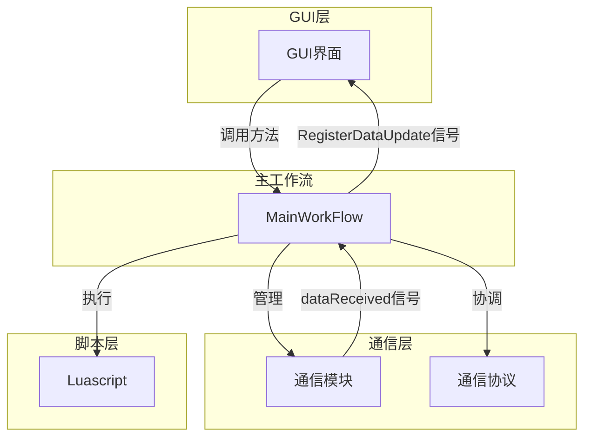
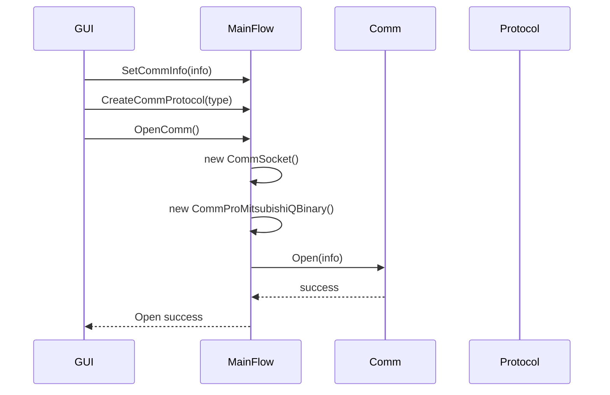
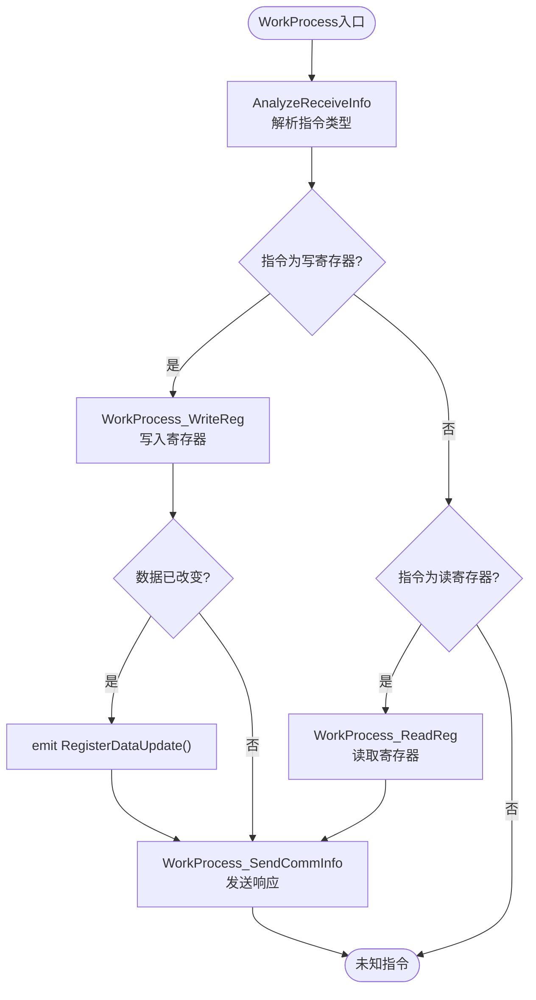
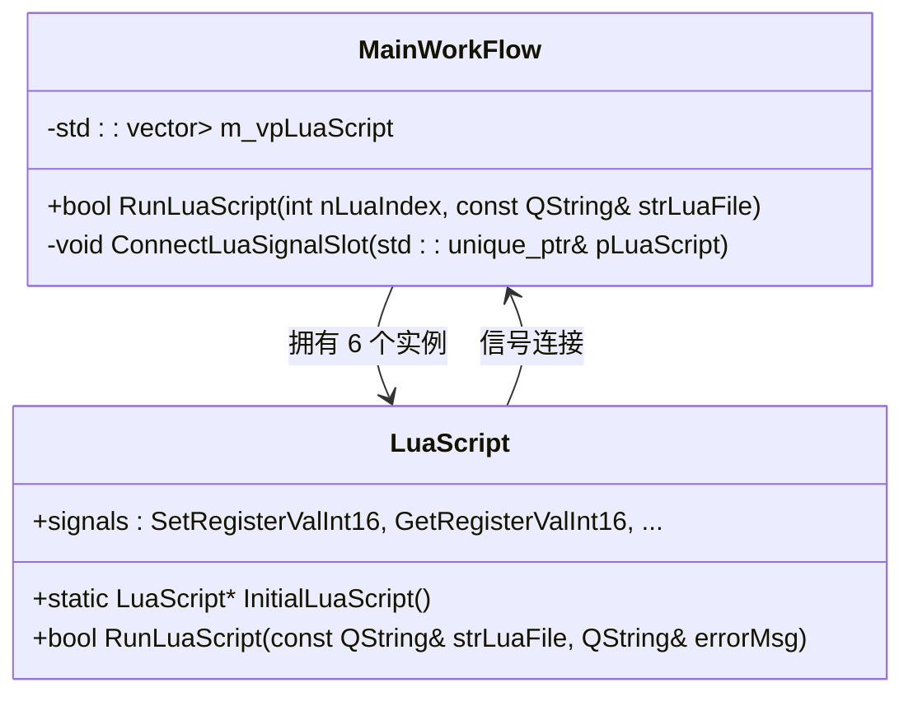
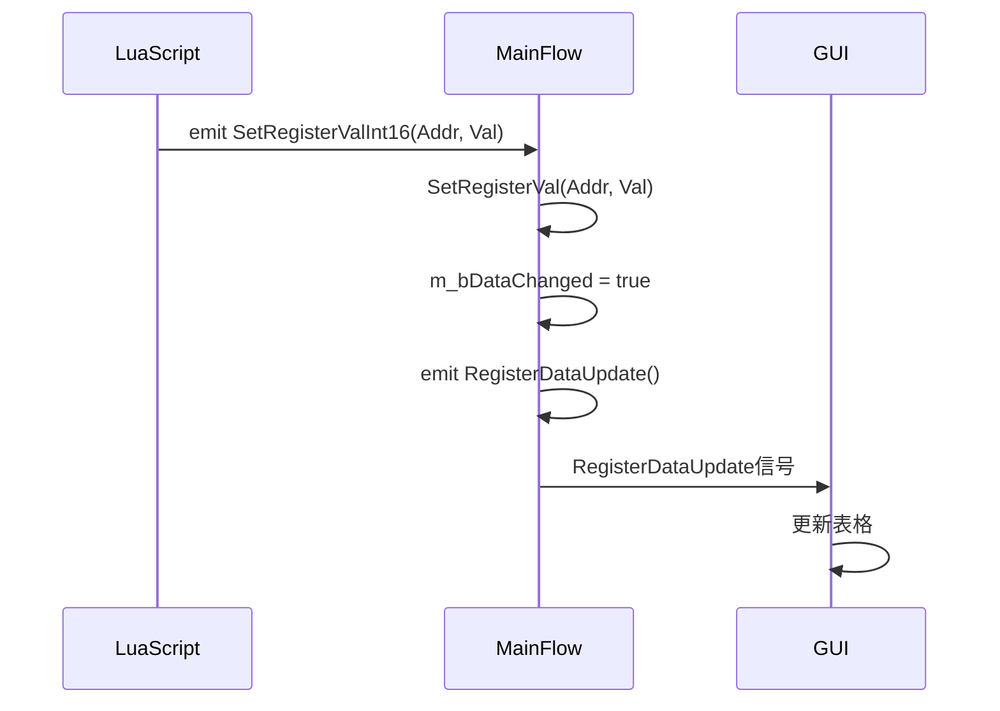
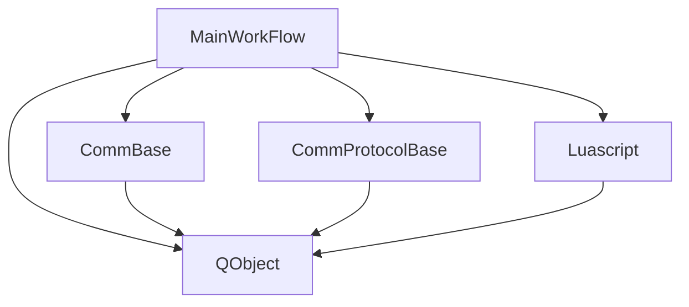

# 主工作流设计

<cite>
**本文档引用文件**  
- [MainWorkFlow.h](file://CommTest_Qt/MainFlow/MainWorkFlow.h)
- [MainWorkFlow.cpp](file://CommTest_Qt/MainFlow/MainWorkFlow.cpp)
- [CommBase.h](file://CommTest_Qt/Comm/CommBase.h)
- [CommProtocolBase.h](file://CommTest_Qt/Comm/Protocol/CommProtocolBase.h)
- [LuaScript.h](file://CommTest_Qt/LuaScript/LuaScript.h)
- [CommSocket.h](file://CommTest_Qt/Comm/Socket/CommSocket.h)
- [CommTest_Qt.h](file://CommTest_Qt/Gui/CommTest_Qt.h)
</cite>

## 目录
1. [简介](#简介)
2. [项目结构](#项目结构)
3. [核心组件](#核心组件)
4. [架构概览](#架构概览)
5. [详细组件分析](#详细组件分析)
6. [依赖分析](#依赖分析)
7. [性能考虑](#性能考虑)
8. [故障排除指南](#故障排除指南)
9. [结论](#结论)

## 简介
`MainWorkFlow` 类是 CommTest_Qt_CMake 项目的核心中枢，采用单例模式实现，确保全局唯一实例。该类负责协调 GUI、通信、协议和 Lua 脚本模块之间的交互，通过 Qt 信号槽机制实现松耦合通信。它管理通信配置、处理接收到的数据、分发读写寄存器逻辑，并执行 Lua 脚本，是整个系统数据流和控制流的中心枢纽。

## 项目结构
项目采用模块化设计，主要分为通信（Comm）、图形用户界面（Gui）、Lua 脚本（LuaScript）和主工作流（MainFlow）四大模块。`MainWorkFlow` 位于 MainFlow 目录下，作为系统的核心协调者，与各模块紧密协作。

**Diagram sources**
- [MainWorkFlow.h](file://CommTest_Qt/MainFlow/MainWorkFlow.h#L30-L112)

## 核心组件
`MainWorkFlow` 类是系统的核心，实现了单例模式以确保全局唯一性，并通过 `InitialWorkFlow` 静态方法进行初始化。它管理通信实例、协议实例、寄存器数据和多个 Lua 脚本虚拟机，是所有业务逻辑的协调中心。

**Section sources**
- [MainWorkFlow.h](file://CommTest_Qt/MainFlow/MainWorkFlow.h#L30-L112)
- [MainWorkFlow.cpp](file://CommTest_Qt/MainFlow/MainWorkFlow.cpp#L9-L35)

## 架构概览
`MainWorkFlow` 作为系统中枢，通过信号槽机制与各模块通信。GUI 层通过调用其 `OpenComm`、`CloseComm` 等方法控制通信，通信模块接收到数据后通过信号通知 `MainWorkFlow`，后者调用 `WorkProcess` 方法处理数据并更新寄存器，最终通过 `RegisterDataUpdate` 信号通知 GUI 更新界面。



**Diagram sources**
- [MainWorkFlow.h](file://CommTest_Qt/MainFlow/MainWorkFlow.h#L30-L112)
- [CommTest_Qt.h](file://CommTest_Qt/Gui/CommTest_Qt.h#L77-L78)

## 详细组件分析

### 单例模式与初始化
`MainWorkFlow` 通过私有化构造函数、拷贝构造函数和赋值操作符，并使用静态成员变量 `s_pInstance` 和互斥锁 `s_mutex` 来实现线程安全的单例模式。`InitialWorkFlow` 方法是获取实例的唯一入口。

```mermaid
classDiagram
class MainWorkFlow {
-static MainWorkFlow* s_pInstance
-static QMutex s_mutex
+static MainWorkFlow* InitialWorkFlow(QObject* pParent)
+static void ReleaseWorkFlow()
-MainWorkFlow(QObject* pParent)
-~MainWorkFlow()
}
note right of MainWorkFlow
私有构造函数确保外部无法直接创建实例
InitialWorkFlow() 是获取唯一实例的全局访问点
end note
```

**Diagram sources**
- [MainWorkFlow.h](file://CommTest_Qt/MainFlow/MainWorkFlow.h#L80-L83)
- [MainWorkFlow.cpp](file://CommTest_Qt/MainFlow/MainWorkFlow.cpp#L154-L166)

**Section sources**
- [MainWorkFlow.h](file://CommTest_Qt/MainFlow/MainWorkFlow.h#L34-L40)
- [MainWorkFlow.cpp](file://CommTest_Qt/MainFlow/MainWorkFlow.cpp#L5-L7)

### 通信与协议管理
`MainWorkFlow` 通过 `SetCommInfo` 和 `GetCommInfo` 接口管理通信配置，并通过 `OpenComm` 和 `CloseComm` 方法控制通信实例的生命周期。`CreateCommProtocol` 方法根据指定的协议类型创建相应的协议实例。



**Diagram sources**
- [MainWorkFlow.h](file://CommTest_Qt/MainFlow/MainWorkFlow.h#L41-L52)
- [MainWorkFlow.cpp](file://CommTest_Qt/MainFlow/MainWorkFlow.cpp#L181-L321)

**Section sources**
- [MainWorkFlow.h](file://CommTest_Qt/MainFlow/MainWorkFlow.h#L46-L52)
- [MainWorkFlow.cpp](file://CommTest_Qt/MainFlow/MainWorkFlow.cpp#L197-L252)

### 数据处理与寄存器管理
`WorkProcess` 方法是处理接收到数据的核心函数。它首先解析指令类型，然后根据指令调用 `WorkProcess_ReadReg` 或 `WorkProcess_WriteReg` 进行具体处理，最后通过 `WorkProcess_SendCommInfo` 发送响应。



**Diagram sources**
- [MainWorkFlow.h](file://CommTest_Qt/MainFlow/MainWorkFlow.h#L53-L54)
- [MainWorkFlow.cpp](file://CommTest_Qt/MainFlow/MainWorkFlow.cpp#L322-L369)

**Section sources**
- [MainWorkFlow.h](file://CommTest_Qt/MainFlow/MainWorkFlow.h#L72-L77)
- [MainWorkFlow.cpp](file://CommTest_Qt/MainFlow/MainWorkFlow.cpp#L434-L536)

### Lua脚本集成
`MainWorkFlow` 初始化了6个 `LuaScript` 实例，并通过 `ConnectLuaSignalSlot` 方法将 Lua 脚本的信号与自身的槽函数连接，实现了双向通信。`RunLuaScript` 方法用于触发指定脚本的执行。



**Diagram sources**
- [MainWorkFlow.h](file://CommTest_Qt/MainFlow/MainWorkFlow.h#L87-L91)
- [LuaScript.h](file://CommTest_Qt/LuaScript/LuaScript.h#L120-L138)

**Section sources**
- [MainWorkFlow.h](file://CommTest_Qt/MainFlow/MainWorkFlow.h#L65-L68)
- [MainWorkFlow.cpp](file://CommTest_Qt/MainFlow/MainWorkFlow.cpp#L58-L151)

### GUI联动机制
`MainWorkFlow` 通过 `RegisterDataUpdate` 信号与 GUI 层联动。当寄存器数据因写入指令或 Lua 脚本执行而改变时，会发出此信号，通知 GUI 更新表格显示。



**Diagram sources**
- [MainWorkFlow.h](file://CommTest_Qt/MainFlow/MainWorkFlow.h#L104-L110)
- [MainWorkFlow.cpp](file://CommTest_Qt/MainFlow/MainWorkFlow.cpp#L62-L64)

**Section sources**
- [MainWorkFlow.h](file://CommTest_Qt/MainFlow/MainWorkFlow.h#L109-L110)
- [CommTest_Qt.h](file://CommTest_Qt/Gui/CommTest_Qt.h#L66-L67)

## 依赖分析
`MainWorkFlow` 依赖于 `CommBase`、`CommProtocolBase` 和 `LuaScript` 等核心类，通过包含其头文件并创建实例来实现功能。它与 GUI 层通过信号槽机制进行松耦合通信。



**Diagram sources**
- [MainWorkFlow.h](file://CommTest_Qt/MainFlow/MainWorkFlow.h#L8-L13)
- [CommBase.h](file://CommTest_Qt/Comm/CommBase.h#L4-L57)
- [CommProtocolBase.h](file://CommTest_Qt/Comm/Protocol/CommProtocolBase.h#L58-L101)

**Section sources**
- [MainWorkFlow.h](file://CommTest_Qt/MainFlow/MainWorkFlow.h#L8-L13)

## 性能考虑
`MainWorkFlow` 使用 `std::vector<std::atomic_int16_t>` 存储寄存器数据，确保了多线程环境下的线程安全。`QMutex` 用于保护单例实例的创建过程。`WorkProcess` 方法的处理流程清晰，避免了不必要的计算，保证了数据处理的高效性。

## 故障排除指南
当通信无法建立时，请检查 `SetCommInfo` 传入的 `CommInfoBase` 实例是否正确，以及 `OpenComm` 方法的返回值。当数据处理异常时，可检查 `WorkProcess_AnalyzeReceiveInfo` 的返回值以确认协议解析是否成功。当 Lua 脚本执行失败时，可通过 `RunLuaScript` 的返回值和错误信息进行排查。

**Section sources**
- [MainWorkFlow.cpp](file://CommTest_Qt/MainFlow/MainWorkFlow.cpp#L415-L424)
- [MainWorkFlow.cpp](file://CommTest_Qt/MainFlow/MainWorkFlow.cpp#L434-L449)

## 结论
`MainWorkFlow` 类通过单例模式、Qt 信号槽机制和清晰的职责划分，成功地实现了作为系统中枢的功能。它有效地协调了 GUI、通信、协议和脚本模块，为 CommTest_Qt_CMake 项目提供了一个稳定、高效且易于扩展的核心架构。