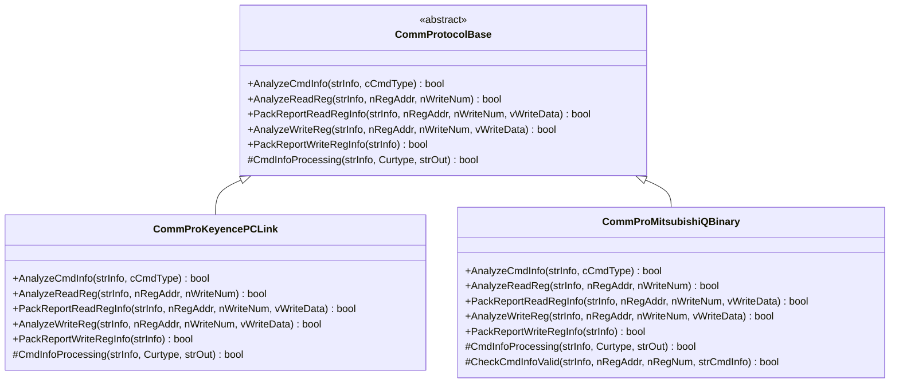
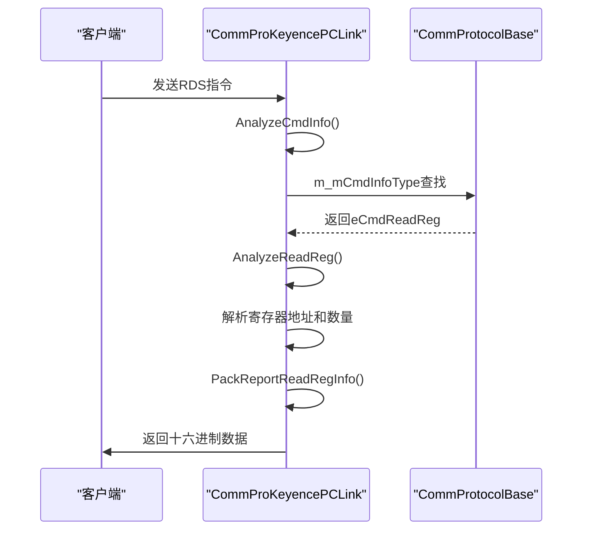
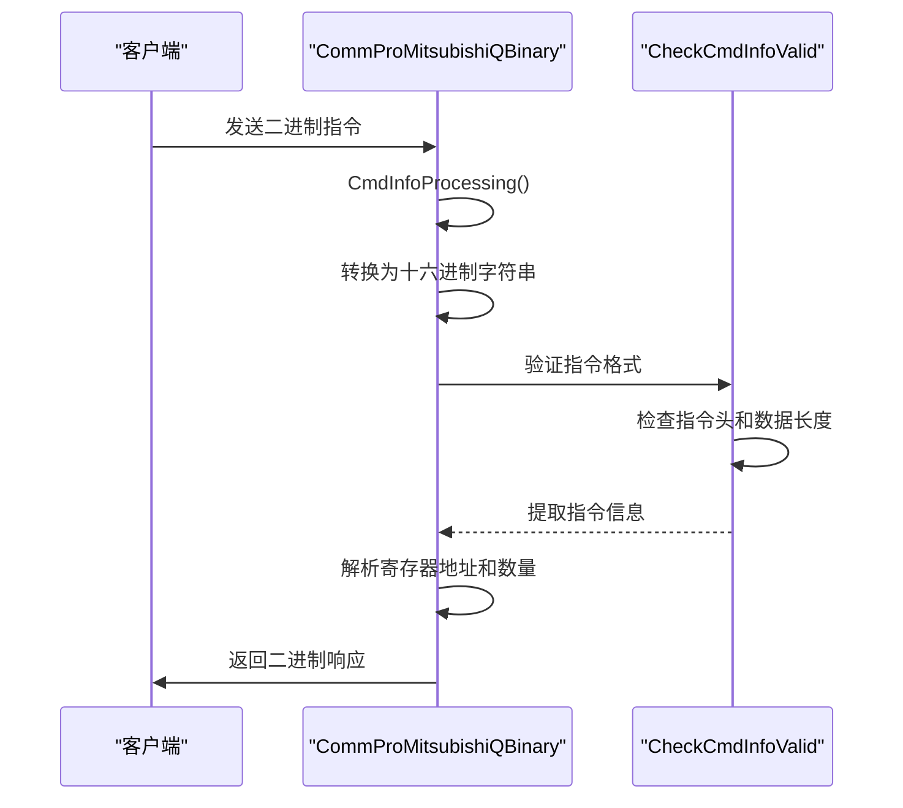
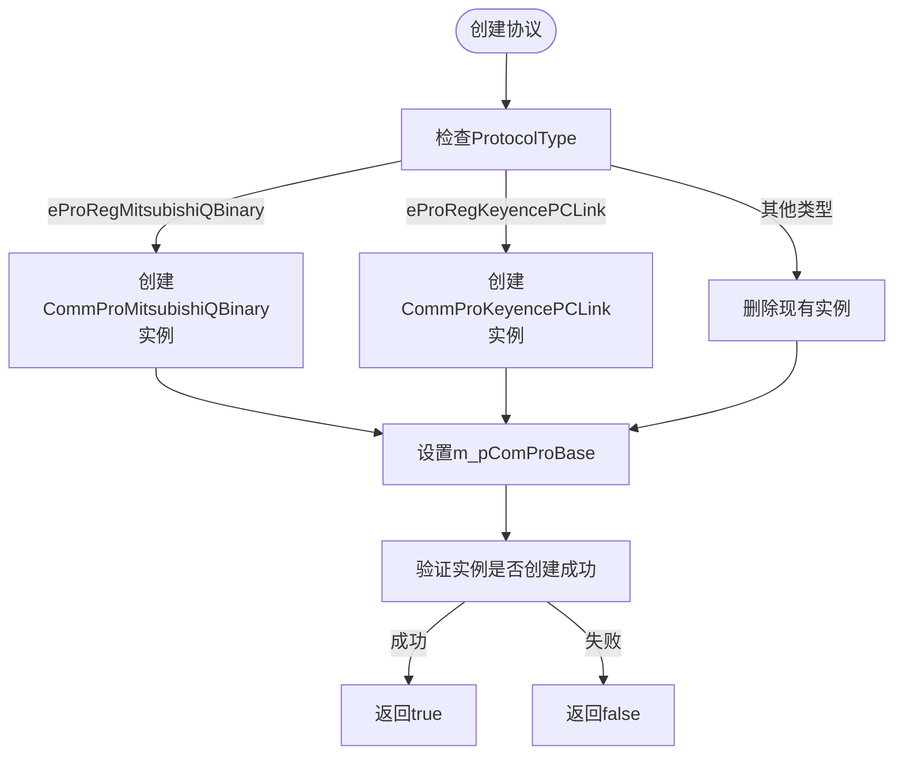
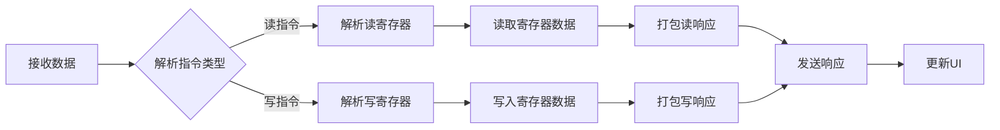

# 协议模块设计

<cite>
**Referenced Files in This Document**   
- [CommProtocolBase.h](file://CommTest_Qt/Comm/Protocol/CommProtocolBase.h)
- [CommProKeyencePCLink.h](file://CommTest_Qt/Comm/Protocol/CommProKeyencePCLink.h)
- [CommProMitsubishiQBinary.h](file://CommTest_Qt/Comm/Protocol/CommProMitsubishiQBinary.h)
- [CommProKeyencePCLink.cpp](file://CommTest_Qt/Comm/Protocol/CommProKeyencePCLink.cpp)
- [CommProMitsubishiQBinary.cpp](file://CommTest_Qt/Comm/Protocol/CommProMitsubishiQBinary.cpp)
- [MainWorkFlow.cpp](file://CommTest_Qt/MainFlow/MainWorkFlow.cpp)
- [MainWorkFlow.h](file://CommTest_Qt/MainFlow/MainWorkFlow.h)
- [CommTest_Qt.cpp](file://CommTest_Qt/Gui/CommTest_Qt.cpp)
</cite>

## 目录
1. [协议模块概述](#协议模块概述)
2. [核心抽象基类分析](#核心抽象基类分析)
3. [具体协议实现分析](#具体协议实现分析)
4. [协议工厂模式](#协议工厂模式)
5. [协议处理流程](#协议处理流程)

## 协议模块概述

协议模块是CommTest_Qt_CMake项目的核心组件，负责处理不同PLC通信协议的指令解析与响应生成。该模块采用面向对象的设计模式，通过抽象基类定义统一的接口规范，由具体子类实现特定协议的逻辑。模块主要包含三个核心部分：`CommProtocolBase`抽象基类、`CommProKeyencePCLink`和`CommProMitsubishiQBinary`两个具体协议实现类。这些组件协同工作，实现了对基恩士PC-LINK和三菱Q系列二进制协议的支持，为上层应用提供了统一的协议处理接口。

**Section sources**
- [CommProtocolBase.h](file://CommTest_Qt/Comm/Protocol/CommProtocolBase.h#L1-L107)
- [CommProKeyencePCLink.h](file://CommTest_Qt/Comm/Protocol/CommProKeyencePCLink.h#L1-L40)
- [CommProMitsubishiQBinary.h](file://CommTest_Qt/Comm/Protocol/CommProMitsubishiQBinary.h#L1-L58)

## 核心抽象基类分析

`CommProtocolBase`类作为协议模块的抽象基类，定义了处理PLC读写指令的模板方法模式。该类继承自`QObject`，并声明了一系列纯虚函数，强制子类实现特定的协议处理逻辑。

**Diagram sources**
- [CommProtocolBase.h](file://CommTest_Qt/Comm/Protocol/CommProtocolBase.h#L59-L102)
- [CommProKeyencePCLink.h](file://CommTest_Qt/Comm/Protocol/CommProKeyencePCLink.h#L4-L36)
- [CommProMitsubishiQBinary.h](file://CommTest_Qt/Comm/Protocol/CommProMitsubishiQBinary.h#L4-L53)

### 模板方法模式

`CommProtocolBase`通过定义`AnalyzeReadReg`、`AnalyzeWriteReg`和`PackReportReadRegInfo`等纯虚方法，形成了处理PLC指令的模板方法模式。这些方法构成了协议处理的核心流程，子类必须根据具体协议规范实现这些方法。例如，`AnalyzeReadReg`用于解析读取寄存器的指令，提取寄存器地址和读取数量；`PackReportReadRegInfo`则负责将读取到的数据打包成符合协议规范的响应信息。

### 指令映射表

基类中定义了`m_mCmdInfoType`成员变量，这是一个`std::map<QByteArray, CmdType>`类型的映射表，用于将不同协议的指令字符串与`CmdType`枚举值关联。在子类的构造函数中，会初始化这个映射表，将特定的指令前缀（如"RDS"或"01040000"）映射到`eCmdReadReg`或`eCmdWriteReg`等命令类型。这种设计使得协议解析过程更加灵活和可扩展。

**Section sources**
- [CommProtocolBase.h](file://CommTest_Qt/Comm/Protocol/CommProtocolBase.h#L101-L102)
- [CommProKeyencePCLink.cpp](file://CommTest_Qt/Comm/Protocol/CommProKeyencePCLink.cpp#L6-L7)
- [CommProMitsubishiQBinary.cpp](file://CommTest_Qt/Comm/Protocol/CommProMitsubishiQBinary.cpp#L6-L7)

## 具体协议实现分析

### 基恩士PC-LINK协议实现

`CommProKeyencePCLink`类实现了基恩士KV系列上位链路协议。该类重写了基类的所有纯虚方法，以支持基恩士PLC的通信需求。

**Diagram sources**
- [CommProKeyencePCLink.h](file://CommTest_Qt/Comm/Protocol/CommProKeyencePCLink.h#L4-L36)
- [CommProKeyencePCLink.cpp](file://CommTest_Qt/Comm/Protocol/CommProKeyencePCLink.cpp#L1-L137)

该实现类在构造函数中将"RDS"映射到`eCmdReadReg`，将"WRS"映射到`eCmdWriteReg`。`AnalyzeReadReg`方法通过解析指令字符串中的固定格式（如"RDS DM.H"）来提取寄存器地址和读取数量。`PackReportReadRegInfo`方法则将读取到的数据转换为大写的十六进制字符串，并用空格分隔，形成符合基恩士协议规范的响应。

### 三菱Q系列二进制协议实现

`CommProMitsubishiQBinary`类实现了三菱MC 3E帧二进制通信协议。与基恩士协议不同，该协议采用二进制格式，因此需要更复杂的解析和打包逻辑。

**Diagram sources**
- [CommProMitsubishiQBinary.h](file://CommTest_Qt/Comm/Protocol/CommProMitsubishiQBinary.h#L4-L53)
- [CommProMitsubishiQBinary.cpp](file://CommTest_Qt/Comm/Protocol/CommProMitsubishiQBinary.cpp#L1-L191)

该实现类引入了`CheckCmdInfoValid`私有方法，用于验证接收到的指令是否符合三菱MC协议的3E帧数据格式。该方法检查指令头（"500000FFFF0300"）、数据长度和指令类型等关键字段，确保指令的完整性和正确性。`CmdInfoProcessing`方法负责在接收和发送数据时进行格式转换：接收时将二进制数据转换为十六进制字符串，发送时则将十六进制字符串转换回二进制数据。

**Section sources**
- [CommProMitsubishiQBinary.h](file://CommTest_Qt/Comm/Protocol/CommProMitsubishiQBinary.h#L37-L47)
- [CommProMitsubishiQBinary.cpp](file://CommTest_Qt/Comm/Protocol/CommProMitsubishiQBinary.cpp#L117-L174)

## 协议工厂模式

协议模块通过工厂模式实现了协议实例的动态创建，确保了系统的可扩展性和灵活性。

**Diagram sources**
- [MainWorkFlow.cpp](file://CommTest_Qt/MainFlow/MainWorkFlow.cpp#L282-L320)

`CreateCommProtocol`方法是工厂模式的核心，它根据传入的`ProtocolType`枚举值动态创建相应的协议实例。该方法首先检查当前是否存在已创建的协议实例，如果存在则先将其删除，然后根据协议类型创建新的实例并赋值给`m_pComProBase`成员变量。这种设计确保了同一时间只有一个协议实例处于活动状态，避免了资源冲突。

**Section sources**
- [MainWorkFlow.h](file://CommTest_Qt/MainFlow/MainWorkFlow.h#L51-L51)
- [MainWorkFlow.cpp](file://CommTest_Qt/MainFlow/MainWorkFlow.cpp#L282-L320)
- [CommTest_Qt.cpp](file://CommTest_Qt/Gui/CommTest_Qt.cpp#L817-L828)

## 协议处理流程

协议模块的处理流程由`MainWorkFlow`类协调，形成了一个完整的指令处理闭环。

**Diagram sources**
- [MainWorkFlow.cpp](file://CommTest_Qt/MainFlow/MainWorkFlow.cpp#L323-L369)

当接收到客户端数据时，`WorkProcess`方法首先调用`AnalyzeCmdInfo`解析指令类型，然后根据指令类型分别调用`AnalyzeReadReg`或`AnalyzeWriteReg`进行详细解析。对于读指令，系统从内部寄存器数组中读取相应数据，并通过`PackReportReadRegInfo`打包成响应；对于写指令，系统将数据写入寄存器，并通过`PackReportWriteRegInfo`生成确认响应。整个流程体现了协议模块与上层应用的紧密协作。

**Section sources**
- [MainWorkFlow.cpp](file://CommTest_Qt/MainFlow/MainWorkFlow.cpp#L323-L369)