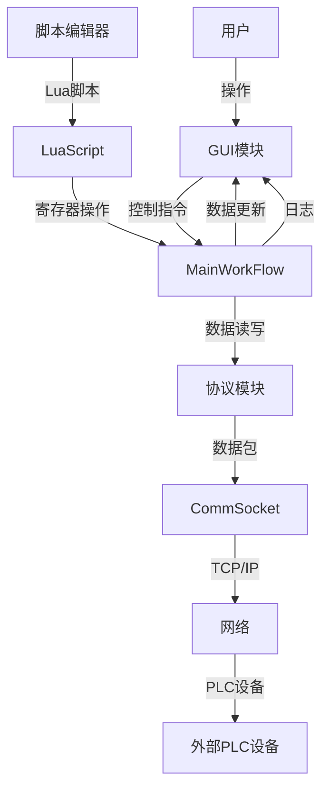
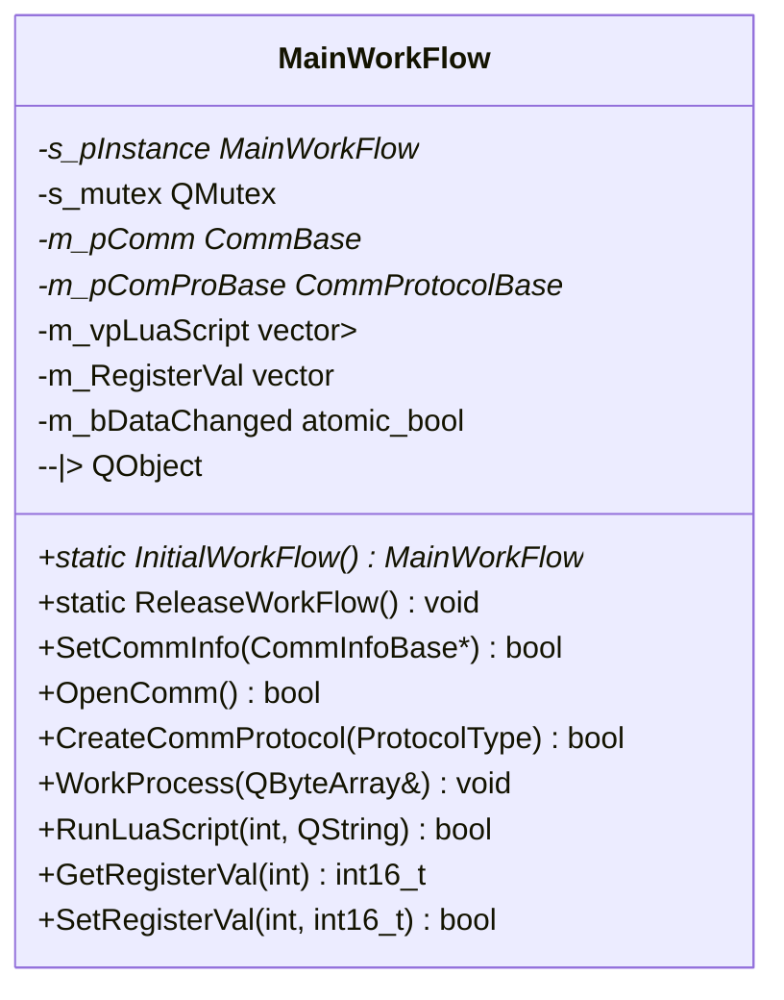
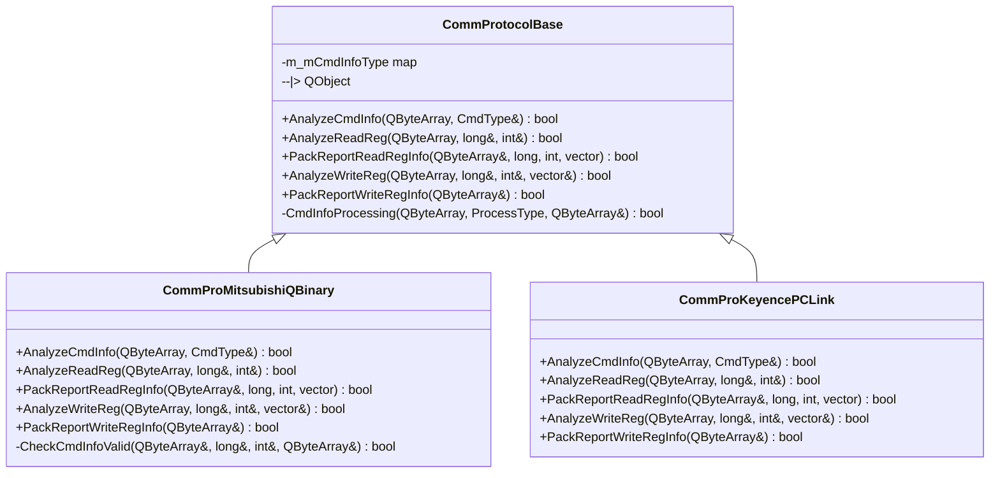
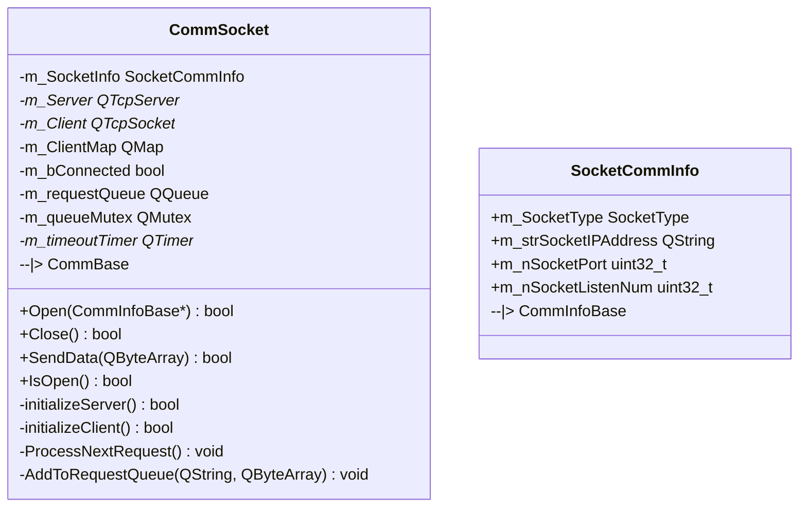
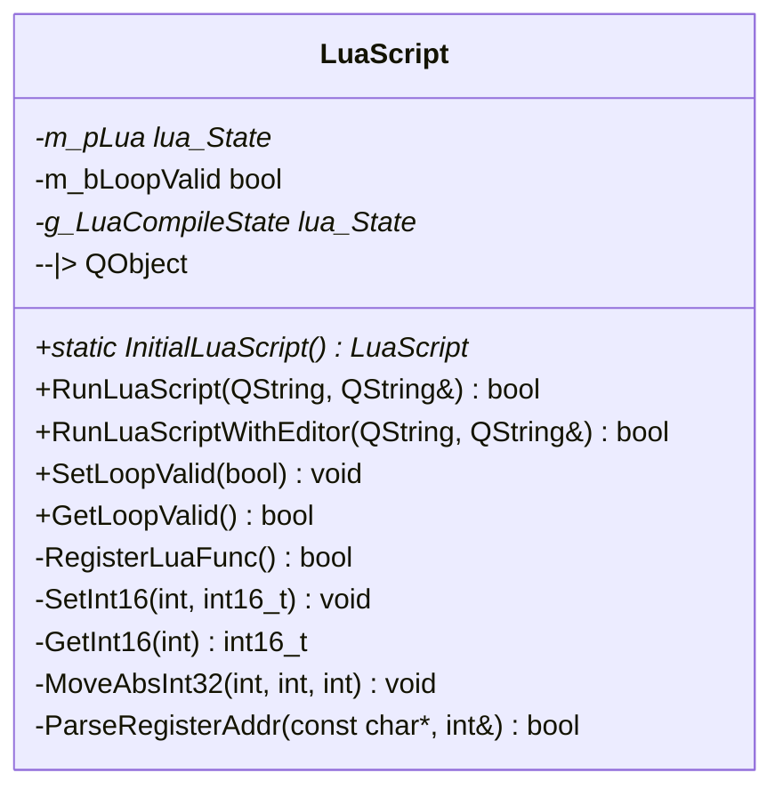
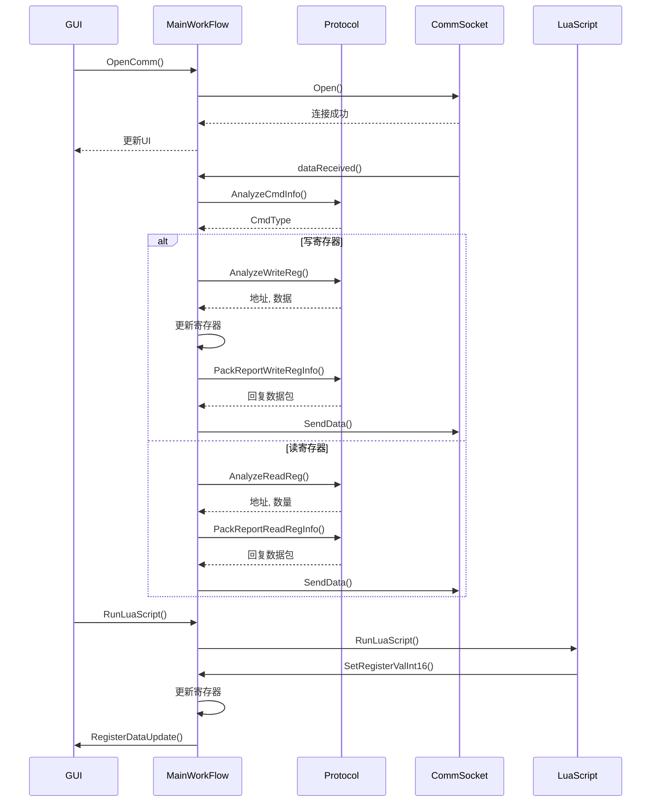

# 技术架构设计

<cite>
**本文档引用的文件**   
- [MainWorkFlow.h](file://CommTest_Qt/MainFlow/MainWorkFlow.h)
- [MainWorkFlow.cpp](file://CommTest_Qt/MainFlow/MainWorkFlow.cpp)
- [CommProtocolBase.h](file://CommTest_Qt/Comm/Protocol/CommProtocolBase.h)
- [CommProMitsubishiQBinary.h](file://CommTest_Qt/Comm/Protocol/CommProMitsubishiQBinary.h)
- [CommProKeyencePCLink.h](file://CommTest_Qt/Comm/Protocol/CommProKeyencePCLink.h)
- [CommSocket.h](file://CommTest_Qt/Comm/Socket/CommSocket.h)
- [CommSocket.cpp](file://CommTest_Qt/Comm/Socket/CommSocket.cpp)
- [LuaScript.h](file://CommTest_Qt/LuaScript/LuaScript.h)
- [LuaScript.cpp](file://CommTest_Qt/LuaScript/LuaScript.cpp)
- [CommBase.h](file://CommTest_Qt/Comm/CommBase.h)
- [ScriptEditor.h](file://CommTest_Qt/Gui/ScriptEditor.h)
</cite>

## 目录
1. [系统上下文图](#系统上下文图)
2. [MVC架构与核心设计思想](#mvc架构与核心设计思想)
3. [MainWorkFlow单例协调者](#mainworkflow单例协调者)
4. [CommProtocolBase协议扩展机制](#commprotocolbase协议扩展机制)
5. [CommSocket网络通信实现](#commsocket网络通信实现)
6. [LuaScript脚本化自动化](#luascript脚本化自动化)
7. [组件关系与数据流](#组件关系与数据流)
8. [观察者模式应用](#观察者模式应用)
9. [模板方法模式体现](#模板方法模式体现)
10. [总结](#总结)

## 系统上下文图

**图源**
- [MainWorkFlow.h](file://CommTest_Qt/MainFlow/MainWorkFlow.h#L30-L112)
- [CommSocket.h](file://CommTest_Qt/Comm/Socket/CommSocket.h#L14-L107)
- [LuaScript.h](file://CommTest_Qt/LuaScript/LuaScript.h#L7-L140)
- [ScriptEditor.h](file://CommTest_Qt/Gui/ScriptEditor.h#L17-L63)

## MVC架构与核心设计思想

CommTest_Qt_CMake项目采用MVC（Model-View-Controller）架构模式，将用户界面（View）、业务逻辑（Controller）和数据模型（Model）进行清晰分离。GUI模块作为视图层，负责展示寄存器数据和用户交互；MainWorkFlow作为核心控制器，协调通信、协议、脚本等模块；寄存器数据和通信状态作为模型层，由MainWorkFlow统一管理。这种设计实现了高内聚低耦合，便于模块独立开发和维护。

**本节源**
- [MainWorkFlow.h](file://CommTest_Qt/MainFlow/MainWorkFlow.h#L30-L112)
- [CommTest_Qt.cpp](file://CommTest_Qt/Gui/CommTest_Qt.cpp#L7-L800)

## MainWorkFlow单例协调者

MainWorkFlow类是整个系统的核心协调者，采用单例模式确保全局唯一实例。它通过私有化构造函数和拷贝构造函数，并提供静态的InitialWorkFlow方法来创建和获取实例，保证了线程安全。MainWorkFlow负责管理GUI、通信、协议和脚本模块之间的交互，作为中央枢纽处理所有业务逻辑。

**图源**
- [MainWorkFlow.h](file://CommTest_Qt/MainFlow/MainWorkFlow.h#L30-L112)
- [MainWorkFlow.cpp](file://CommTest_Qt/MainFlow/MainWorkFlow.cpp#L1-L544)

**本节源**
- [MainWorkFlow.h](file://CommTest_Qt/MainFlow/MainWorkFlow.h#L30-L112)
- [MainWorkFlow.cpp](file://CommTest_Qt/MainFlow/MainWorkFlow.cpp#L1-L544)

## CommProtocolBase协议扩展机制

CommProtocolBase是一个抽象基类，定义了PLC协议处理的通用接口。通过工厂模式，MainWorkFlow可以根据不同的ProtocolType枚举值创建具体的协议实例，如CommProMitsubishiQBinary或CommProKeyencePCLink。这种设计支持多种PLC协议的扩展，新增协议只需继承CommProtocolBase并实现其纯虚函数。

**图源**
- [CommProtocolBase.h](file://CommTest_Qt/Comm/Protocol/CommProtocolBase.h#L59-L101)
- [CommProMitsubishiQBinary.h](file://CommTest_Qt/Comm/Protocol/CommProMitsubishiQBinary.h#L4-L53)
- [CommProKeyencePCLink.h](file://CommTest_Qt/Comm/Protocol/CommProKeyencePCLink.h#L4-L36)

**本节源**
- [CommProtocolBase.h](file://CommTest_Qt/Comm/Protocol/CommProtocolBase.h#L59-L101)
- [CommProMitsubishiQBinary.h](file://CommTest_Qt/Comm/Protocol/CommProMitsubishiQBinary.h#L4-L53)
- [CommProKeyencePCLink.h](file://CommTest_Qt/Comm/Protocol/CommProKeyencePCLink.h#L4-L36)

## CommSocket网络通信实现

CommSocket类实现了TCP网络通信，继承自CommBase抽象基类。它支持服务器和客户端两种模式，通过SocketCommInfo结构体管理IP地址、端口号等关键参数。CommSocket使用QTcpSocket和QTcpServer进行数据收发，并通过请求队列和超时机制处理并发请求，确保通信的稳定性和可靠性。

**图源**
- [CommSocket.h](file://CommTest_Qt/Comm/Socket/CommSocket.h#L14-L107)
- [CommBase.h](file://CommTest_Qt/Comm/CommBase.h#L4-L66)

**本节源**
- [CommSocket.h](file://CommTest_Qt/Comm/Socket/CommSocket.h#L14-L107)
- [CommSocket.cpp](file://CommTest_Qt/Comm/Socket/CommSocket.cpp#L1-L544)

## LuaScript脚本化自动化

LuaScript类封装了Lua引擎，支持脚本化自动化测试。它通过静态方法InitialLuaScript创建实例，并将C++函数注册到Lua环境，如SetInt16、GetInt16等。Lua脚本可以调用这些函数读写寄存器，实现复杂的自动化逻辑。MainWorkFlow管理多个LuaScript实例，支持并行执行不同的测试脚本。

**图源**
- [LuaScript.h](file://CommTest_Qt/LuaScript/LuaScript.h#L7-L140)
- [LuaScript.cpp](file://CommTest_Qt/LuaScript/LuaScript.cpp#L1-L764)

**本节源**
- [LuaScript.h](file://CommTest_Qt/LuaScript/LuaScript.h#L7-L140)
- [LuaScript.cpp](file://CommTest_Qt/LuaScript/LuaScript.cpp#L1-L764)

## 组件关系与数据流

各模块通过MainWorkFlow紧密协作，形成清晰的数据流。GUI模块通过信号槽与MainWorkFlow交互，触发通信和脚本执行。CommSocket接收网络数据，转发给MainWorkFlow处理。MainWorkFlow根据协议类型调用相应的CommProtocolBase派生类解析数据，并更新寄存器值。LuaScript通过信号与MainWorkFlow通信，实现寄存器读写和平台控制。

**图源**
- [MainWorkFlow.h](file://CommTest_Qt/MainFlow/MainWorkFlow.h#L30-L112)
- [CommSocket.h](file://CommTest_Qt/Comm/Socket/CommSocket.h#L14-L107)
- [CommProtocolBase.h](file://CommTest_Qt/Comm/Protocol/CommProtocolBase.h#L59-L101)
- [LuaScript.h](file://CommTest_Qt/LuaScript/LuaScript.h#L7-L140)

**本节源**
- [MainWorkFlow.h](file://CommTest_Qt/MainFlow/MainWorkFlow.h#L30-L112)
- [CommSocket.h](file://CommTest_Qt/Comm/Socket/CommSocket.h#L14-L107)
- [CommProtocolBase.h](file://CommTest_Qt/Comm/Protocol/CommProtocolBase.h#L59-L101)
- [LuaScript.h](file://CommTest_Qt/LuaScript/LuaScript.h#L7-L140)

## 观察者模式应用

项目广泛使用Qt的信号槽机制实现观察者模式，促进组件解耦。MainWorkFlow定义了commLogRecord、dataReceived等信号，GUI模块作为观察者连接这些信号，实时更新日志和界面。LuaScript发出SetRegisterValInt16等信号，MainWorkFlow作为观察者接收并更新寄存器值。这种设计使得模块间通信松散，易于扩展和维护。

**本节源**
- [MainWorkFlow.h](file://CommTest_Qt/MainFlow/MainWorkFlow.h#L104-L113)
- [LuaScript.h](file://CommTest_Qt/LuaScript/LuaScript.h#L120-L140)
- [CommTest_Qt.cpp](file://CommTest_Qt/Gui/CommTest_Qt.cpp#L366-L407)

## 模板方法模式体现

在协议处理流程中体现了模板方法模式。CommProtocolBase定义了CmdInfoProcessing的纯虚函数作为模板方法，规定了处理通信指令的算法骨架。具体的协议类如CommProMitsubishiQBinary重写该方法，实现特定的协议解析逻辑。这种设计确保了协议处理流程的一致性，同时允许各协议灵活实现细节。

**本节源**
- [CommProtocolBase.h](file://CommTest_Qt/Comm/Protocol/CommProtocolBase.h#L98-L98)
- [CommProMitsubishiQBinary.h](file://CommTest_Qt/Comm/Protocol/CommProMitsubishiQBinary.h#L49-L49)
- [CommProKeyencePCLink.h](file://CommTest_Qt/Comm/Protocol/CommProKeyencePCLink.h#L35-L35)

## 总结

CommTest_Qt_CMake项目通过MVC架构和多种设计模式，构建了一个模块化、可扩展的通信测试系统。MainWorkFlow作为单例协调者，有效管理了GUI、通信、协议和脚本模块的交互。CommProtocolBase通过工厂模式支持多种PLC协议扩展，CommSocket实现了可靠的TCP网络通信，LuaScript则提供了强大的脚本化自动化能力。Qt信号槽机制的应用，使得组件间解耦，系统更加灵活和健壮。