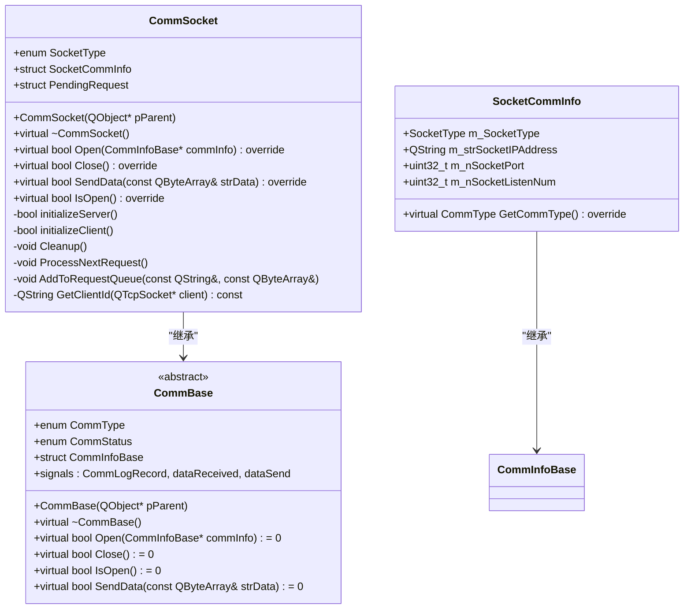
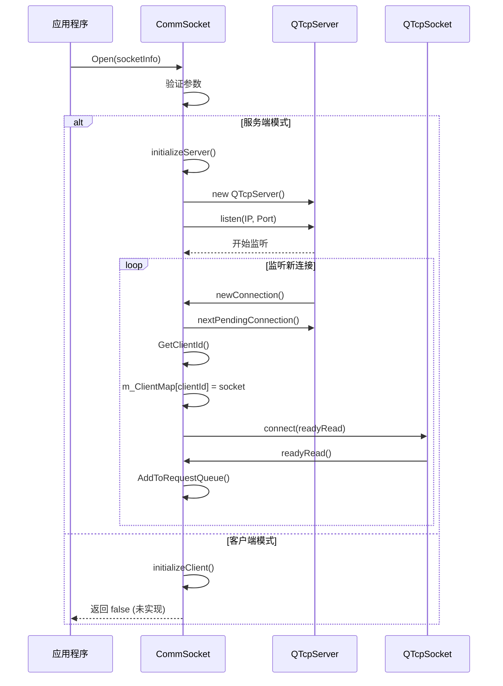
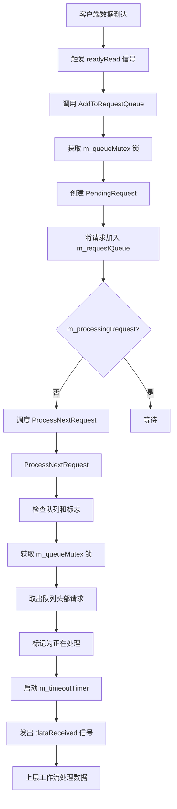
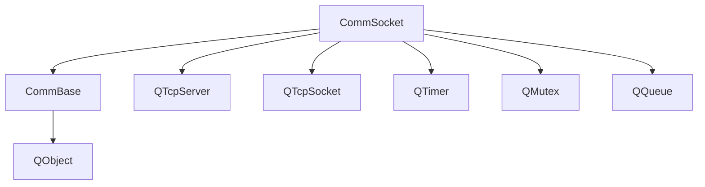

# 通信模块设计

<cite>
**Referenced Files in This Document**   
- [CommBase.h](file://CommTest_Qt/Comm/CommBase.h)
- [CommBase.cpp](file://CommTest_Qt/Comm/CommBase.cpp)
- [CommSocket.h](file://CommTest_Qt/Comm/Socket/CommSocket.h)
- [CommSocket.cpp](file://CommTest_Qt/Comm/Socket/CommSocket.cpp)
- [CommDefine.h](file://CommTest_Qt/Comm/CommDefine.h)
</cite>

## 目录
1. [简介](#简介)
2. [核心组件](#核心组件)
3. [架构概览](#架构概览)
4. [详细组件分析](#详细组件分析)
5. [依赖分析](#依赖分析)
6. [性能考量](#性能考量)
7. [故障排除指南](#故障排除指南)
8. [结论](#结论)

## 简介
本文档详细阐述了CommTest_Qt_CMake项目中通信模块的设计与实现，重点聚焦于`CommSocket`类如何通过继承`CommBase`抽象基类来实现TCP网络通信功能。文档深入分析了该模块的核心设计模式、关键数据结构、并发处理机制以及事件通知系统，旨在为开发者提供一个全面、清晰的架构视图。

## 核心组件
通信模块的核心由`CommBase`抽象基类和`CommSocket`具体实现类构成。`CommBase`定义了所有通信方式（如串口、网络）必须实现的统一接口，包括打开、关闭连接、发送数据和检查连接状态等。`CommSocket`作为其子类，专门负责TCP网络通信的具体实现，它利用Qt框架的`QTcpServer`和`QTcpSocket`类来管理服务端与客户端的连接。

**Section sources**
- [CommBase.h](file://CommTest_Qt/Comm/CommBase.h#L1-L66)
- [CommSocket.h](file://CommTest_Qt/Comm/Socket/CommSocket.h#L1-L114)

## 架构概览
该通信模块采用经典的面向对象设计模式，通过抽象基类定义接口，具体子类实现细节，实现了良好的代码复用和扩展性。整体架构清晰地分离了通信协议的通用逻辑与具体网络实现。



**Diagram sources**
- [CommBase.h](file://CommTest_Qt/Comm/CommBase.h#L4-L57)
- [CommSocket.h](file://CommTest_Qt/Comm/Socket/CommSocket.h#L14-L108)

## 详细组件分析

### CommBase 抽象基类分析
`CommBase`类是整个通信模块的基石，它是一个继承自`QObject`的抽象类，利用Qt的信号与槽机制实现事件驱动。它定义了`CommType`枚举来区分不同的通信类型（串口、网络），并定义了`CommInfoBase`结构体作为传递通信参数的基类。所有具体的通信功能都通过纯虚函数暴露，强制子类必须实现这些接口。

#### 类图
```mermaid
classDiagram
class CommBase {
<<abstract>>
+enum CommType {eCommUnknown, eSerial, eSocket}
+enum CommStatus {eCommSucceed, eCommErr, eCommUnConnect, eCommStop, eCommTimeOut}
+struct CommInfoBase
+CommBase(QObject* pParent)
+virtual ~CommBase()
+virtual bool Open(CommInfoBase* commInfo) = 0
+virtual bool Close() = 0
+virtual bool IsOpen() = 0
+virtual bool SendData(const QByteArray& strData) = 0
+signals : CommLogRecord(QString), dataReceived(QString, QByteArray), dataSend(QString, QByteArray)
}
class CommInfoBase {
+QString m_strCommStop
+QString m_strCmdStop
+CommInfoBase()
+virtual CommType GetCommType() = 0
+virtual ~CommInfoBase()
}
CommBase <|-- CommSocket : "继承"
CommInfoBase <|-- SocketCommInfo : "继承"
```

**Diagram sources**
- [CommBase.h](file://CommTest_Qt/Comm/CommBase.h#L4-L57)

**Section sources**
- [CommBase.h](file://CommTest_Qt/Comm/CommBase.h#L1-L66)
- [CommBase.cpp](file://CommTest_Qt/Comm/CommBase.cpp#L1-L11)

### CommSocket 类分析
`CommSocket`是`CommBase`的具体实现，专门处理TCP通信。它通过`SocketCommInfo`结构体接收配置参数，并根据配置初始化为服务端或客户端。

#### SocketCommInfo 结构体
`SocketCommInfo`继承自`CommInfoBase`，封装了TCP通信所需的所有关键参数：
- `m_SocketType`: 指定是服务端(`eSTServer`)还是客户端(`eSTClient`)。
- `m_strSocketIPAddress`: 绑定的IP地址，服务端默认为"0.0.0.0"。
- `m_nSocketPort`: 监听或连接的端口号，服务端默认为2000。
- `m_nSocketListenNum`: 服务端的最大挂起连接数，默认为10。

该结构体还重写了`GetCommType()`方法，返回`eSocket`，以满足`CommBase`的接口要求。

**Section sources**
- [CommSocket.h](file://CommTest_Qt/Comm/Socket/CommSocket.h#L28-L50)

#### 初始化流程分析
`CommSocket`的`Open`方法是整个通信的入口。它首先验证传入的`CommInfoBase`参数是否为`SocketCommInfo`类型，然后根据`m_SocketType`的值调用相应的初始化函数。

- **服务端初始化 (`initializeServer`)**:
  1. 创建`QTcpServer`实例。
  2. 设置最大挂起连接数。
  3. 调用`listen()`方法开始监听指定的IP和端口。
  4. 连接`newConnection`信号，当有新客户端连接时，通过`nextPendingConnection()`获取`QTcpSocket`对象，并将其加入`m_ClientMap`映射中。
  5. 为每个新客户端的`readyRead`信号建立连接，当客户端有数据可读时，会触发`AddToRequestQueue`方法。

- **客户端初始化 (`initializeClient`)**:
  当前代码中此方法尚未实现，返回`false`。



**Diagram sources**
- [CommSocket.h](file://CommTest_Qt/Comm/Socket/CommSocket.h#L67-L68)
- [CommSocket.cpp](file://CommTest_Qt/Comm/Socket/CommSocket.cpp#L43-L127)

**Section sources**
- [CommSocket.h](file://CommTest_Qt/Comm/Socket/CommSocket.h#L58-L68)
- [CommSocket.cpp](file://CommTest_Qt/Comm/Socket/CommSocket.cpp#L172-L198)

### 请求队列与数据处理机制
为了保证数据处理的有序性和线程安全，`CommSocket`设计了一套基于队列的请求处理机制。

#### 核心组件
- `m_requestQueue`: 一个`QQueue<PendingRequest>`，用于存储待处理的客户端请求。
- `PendingRequest`: 结构体，包含`clientId`、`requestData`、`timestamp`等信息。
- `m_queueMutex`: `QMutex`，用于保护`m_requestQueue`，防止多线程访问冲突。
- `m_processingRequest`: 布尔标志，指示当前是否正在处理一个请求。

#### 协同工作流程
1. **添加请求 (`AddToRequestQueue`)**:
   - 当客户端有数据到达时，`readyRead`信号被触发。
   - `AddToRequestQueue`方法被调用，它使用`QMutexLocker`锁定`m_queueMutex`。
   - 创建一个`PendingRequest`对象，填充`clientId`和`requestData`，并将其入队。
   - 如果当前没有正在处理的请求，则通过`QTimer::singleShot(0, ...)`立即调度`ProcessNextRequest`。

2. **处理请求 (`ProcessNextRequest`)**:
   - 该方法首先检查`m_processingRequest`和队列状态，避免重复处理。
   - 使用`QMutexLocker`锁定`m_queueMutex`，从队列头部取出一个请求。
   - 将该请求标记为`isProcessing = true`，并设置`m_processingRequest`为`true`。
   - 启动`m_timeoutTimer`（如果需要响应）。
   - 发出`dataReceived`信号，将数据传递给上层工作流。



**Diagram sources**
- [CommSocket.h](file://CommTest_Qt/Comm/Socket/CommSocket.h#L84-L91)
- [CommSocket.h](file://CommTest_Qt/Comm/Socket/CommSocket.h#L101-L103)
- [CommSocket.cpp](file://CommTest_Qt/Comm/Socket/CommSocket.cpp#L278-L334)

**Section sources**
- [CommSocket.h](file://CommTest_Qt/Comm/Socket/CommSocket.h#L84-L104)
- [CommSocket.cpp](file://CommTest_Qt/Comm/Socket/CommSocket.cpp#L278-L334)

### 超时机制分析
`m_timeoutTimer`是一个`QTimer`对象，用于防止请求处理过程无限期挂起，从而提升系统的健壮性。

- **启动**: 在`ProcessNextRequest`方法中，当一个新请求开始处理时，如果`requiresResponse`为`true`，则启动定时器。
- **超时处理**: 定时器的`timeout`信号连接到一个Lambda函数。该函数会：
  1. 检查当前是否正在处理请求。
  2. 如果是，则记录超时日志，并将该请求从队列中移除。
  3. 重置处理标志。
  4. 调用`ProcessNextRequest`处理下一个请求。

这种机制确保了即使上层工作流未能及时调用`SendData`，系统也能从“卡死”状态中恢复，继续处理后续的请求。

**Section sources**
- [CommSocket.h](file://CommTest_Qt/Comm/Socket/CommSocket.h#L106-L108)
- [CommSocket.cpp](file://CommTest_Qt/Comm/Socket/CommSocket.cpp#L11-L35)

### 事件通知与解耦
`CommSocket`通过Qt的信号与槽机制实现了与上层模块的解耦。

- **`dataReceived` 信号**:
  - 在`ProcessNextRequest`中被触发。
  - 携带`clientId`和`requestData`，通知上层工作流有新的数据需要处理。
  - 上层模块（如`MainWorkFlow`）可以连接此信号，执行业务逻辑。

- **`dataSend` 信号**:
  - 在`SendData`方法中被触发。
  - 当数据成功发送给客户端后，发出此信号，可用于日志记录或状态更新。

- **`CommLogRecord` 信号**:
  - 用于记录所有通信相关的日志，如连接建立、断开、错误和超时等。

这种设计使得`CommSocket`专注于底层通信，而将业务逻辑完全交给上层模块处理，实现了清晰的关注点分离。

**Section sources**
- [CommBase.h](file://CommTest_Qt/Comm/CommBase.h#L8-L11)
- [CommSocket.cpp](file://CommTest_Qt/Comm/Socket/CommSocket.cpp#L333-L334)
- [CommSocket.cpp](file://CommTest_Qt/Comm/Socket/CommSocket.cpp#L268-L269)

## 依赖分析
`CommSocket`模块的依赖关系清晰，主要依赖于Qt框架的核心网络和线程类。



**Diagram sources**
- [CommSocket.h](file://CommTest_Qt/Comm/Socket/CommSocket.h#L3-L10)
- [CommBase.h](file://CommTest_Qt/Comm/CommBase.h#L3-L4)

**Section sources**
- [CommSocket.h](file://CommTest_Qt/Comm/Socket/CommSocket.h#L3-L10)
- [CommBase.h](file://CommTest_Qt/Comm/CommBase.h#L3-L4)

## 性能考量
- **并发处理**: 通过`m_requestQueue`和`m_queueMutex`，模块能够安全地处理来自多个客户端的并发请求，避免了数据竞争。
- **定时器调度**: 使用`QTimer::singleShot(0, ...)`来调度`ProcessNextRequest`，这是一种非阻塞的、事件驱动的方式，不会阻塞主线程。
- **内存管理**: 使用`deleteLater()`来安全地销毁`QTcpSocket`对象，确保在事件循环的下一个周期才进行删除，避免了在信号处理函数中直接删除对象可能引发的问题。

## 故障排除指南
- **无法建立连接**: 检查`SocketCommInfo`中的IP和端口配置是否正确，确保端口未被占用。
- **数据接收不到**: 确认`dataReceived`信号是否已正确连接到上层处理函数。
- **请求超时**: 检查上层工作流处理逻辑是否耗时过长，或`m_requestTimeout`设置是否过短。
- **客户端断开**: 检查网络状况，或查看`CommLogRecord`信号输出的错误信息。

**Section sources**
- [CommSocket.cpp](file://CommTest_Qt/Comm/Socket/CommSocket.cpp#L95-L102)
- [CommSocket.cpp](file://CommTest_Qt/Comm/Socket/CommSocket.cpp#L121-L124)

## 结论
`CommSocket`类通过继承`CommBase`抽象基类，成功实现了TCP网络通信功能。其设计精巧，利用Qt的信号与槽、多线程同步和定时器机制，构建了一个健壮、有序且解耦的通信模块。`SocketCommInfo`结构体提供了灵活的配置能力，而基于队列的请求处理和超时机制则确保了系统的稳定性和可靠性。该设计为未来的功能扩展（如实现客户端模式）奠定了坚实的基础。