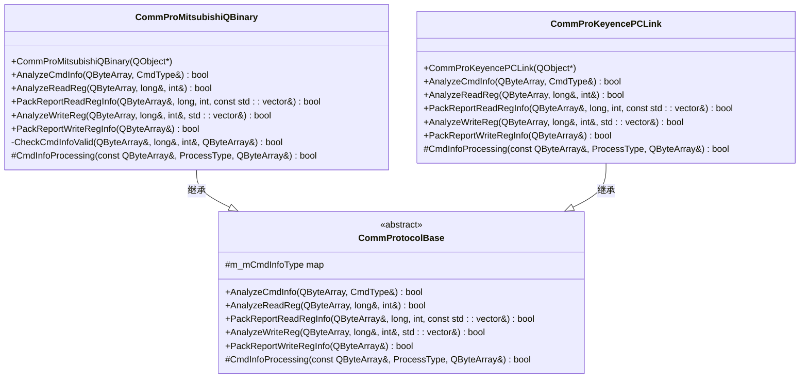
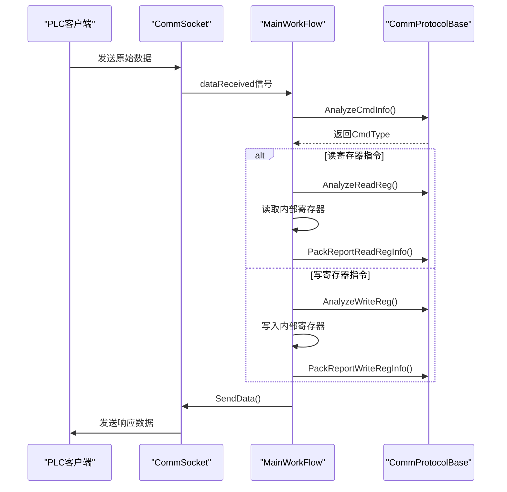

# PLC通信协议支持

<cite>
**本文档引用的文件**   
- [CommProtocolBase.h](file://CommTest_Qt/Comm/Protocol/CommProtocolBase.h)
- [CommProMitsubishiQBinary.h](file://CommTest_Qt/Comm/Protocol/CommProMitsubishiQBinary.h)
- [CommProMitsubishiQBinary.cpp](file://CommTest_Qt/Comm/Protocol/CommProMitsubishiQBinary.cpp)
- [CommProKeyencePCLink.h](file://CommTest_Qt/Comm/Protocol/CommProKeyencePCLink.h)
- [CommProKeyencePCLink.cpp](file://CommTest_Qt/Comm/Protocol/CommProKeyencePCLink.cpp)
- [CommSocket.h](file://CommTest_Qt/Comm/Socket/CommSocket.h)
- [CommSocket.cpp](file://CommTest_Qt/Comm/Socket/CommSocket.cpp)
- [MainWorkFlow.h](file://CommTest_Qt/MainFlow/MainWorkFlow.h)
- [MainWorkFlow.cpp](file://CommTest_Qt/MainFlow/MainWorkFlow.cpp)
</cite>

## 目录
1. [引言](#引言)
2. [核心协议架构](#核心协议架构)
3. [三菱Q系列二进制协议实现](#三菱q系列二进制协议实现)
4. [基恩士PC-LINK协议实现](#基恩士pc-link协议实现)
5. [协议状态机与数据帧格式](#协议状态机与数据帧格式)
6. [与CommSocket的交互流程](#与commsocket的交互流程)
7. [通信日志示例](#通信日志示例)
8. [新协议扩展指南](#新协议扩展指南)
9. [结论](#结论)

## 引言
本文档深入解析了在Qt框架下实现的PLC通信系统，重点阐述了三菱Q系列二进制协议和基恩士PC-LINK协议的软件实现机制。该系统采用面向对象的设计模式，通过一个抽象基类`CommProtocolBase`来定义通信协议的通用接口，使得具体的协议实现（如`CommProMitsubishiQBinary`和`CommProKeyencePCLink`）能够继承并实现这些接口，从而保证了代码的可扩展性和可维护性。文档将详细说明这两个具体协议类如何继承抽象基类，并实现报文的编码、解码、校验与响应处理逻辑，同时结合代码分析其与底层通信模块`CommSocket`的交互流程。

## 核心协议架构

本系统的核心通信协议架构基于抽象基类`CommProtocolBase`，它定义了一套标准的接口，用于处理不同PLC设备的通信协议。所有具体的协议实现都必须继承此类，并实现其纯虚函数。



**图表来源**
- [CommProtocolBase.h](file://CommTest_Qt/Comm/Protocol/CommProtocolBase.h#L58-L101)
- [CommProMitsubishiQBinary.h](file://CommTest_Qt/Comm/Protocol/CommProMitsubishiQBinary.h#L3-L52)
- [CommProKeyencePCLink.h](file://CommTest_Qt/Comm/Protocol/CommProKeyencePCLink.h#L3-L35)

**本节来源**
- [CommProtocolBase.h](file://CommTest_Qt/Comm/Protocol/CommProtocolBase.h#L1-L107)
- [CommProMitsubishiQBinary.h](file://CommTest_Qt/Comm/Protocol/CommProMitsubishiQBinary.h#L1-L58)
- [CommProKeyencePCLink.h](file://CommTest_Qt/Comm/Protocol/CommProKeyencePCLink.h#L1-L40)

## 三菱Q系列二进制协议实现

`CommProMitsubishiQBinary`类实现了三菱MC 3E帧二进制通信协议。该协议使用二进制格式进行数据交换，具有较高的传输效率。

### 报文解析与构建
该类通过重写基类的虚函数来实现特定的报文处理逻辑。例如，`AnalyzeReadReg`函数用于解析来自PLC的读寄存器请求，它会检查报文头是否符合"500000FFFF0300"的格式，并提取出寄存器地址和读取数量。`PackReportReadRegInfo`函数则负责构建响应报文，将读取到的寄存器数据按照协议格式打包成以"D00000FFFF0300"开头的二进制字符串。

### 数据转换与校验
在`CheckCmdInfoValid`私有方法中，实现了对收到的报文进行有效性校验。它会检查指令头、数据长度以及指令代码（"01040000"为读，"01140000"为写）是否正确。此外，`CmdInfoProcessing`方法负责在接收和发送时对数据进行处理：接收时将原始数据转换为大写十六进制字符串，发送时则将十六进制字符串转换回二进制数据。

**本节来源**
- [CommProMitsubishiQBinary.h](file://CommTest_Qt/Comm/Protocol/CommProMitsubishiQBinary.h#L1-L58)
- [CommProMitsubishiQBinary.cpp](file://CommTest_Qt/Comm/Protocol/CommProMitsubishiQBinary.cpp#L1-L191)

## 基恩士PC-LINK协议实现

`CommProKeyencePCLink`类实现了基恩士KV系列上位链路协议。该协议采用ASCII文本格式，指令直观易读。

### 报文解析与构建
与三菱协议不同，基恩士协议的指令以文本形式出现。`AnalyzeReadReg`函数通过查找"RDS"指令头来识别读寄存器命令，并解析后续的寄存器类型（如"DM"）、地址和数据格式（".H"表示十六进制）。`PackReportReadRegInfo`函数在构建响应时，会将每个16位整数转换为4位十六进制字符串，并用空格分隔，最后拼接成一个字符串。

### 简化的数据处理
基恩士协议的`CmdInfoProcessing`方法非常简单，因为它不需要对数据进行额外的编码或解码，直接使用原始数据即可。这使得该协议的实现相对轻量。

**本节来源**
- [CommProKeyencePCLink.h](file://CommTest_Qt/Comm/Protocol/CommProKeyencePCLink.h#L1-L40)
- [CommProKeyencePCLink.cpp](file://CommTest_Qt/Comm/Protocol/CommProKeyencePCLink.cpp#L1-L137)

## 协议状态机与数据帧格式

系统通过`MainWorkFlow`类管理整个通信流程，形成了一个清晰的状态机。



**图表来源**
- [MainWorkFlow.cpp](file://CommTest_Qt/MainFlow/MainWorkFlow.cpp#L323-L369)
- [CommSocket.cpp](file://CommTest_Qt/Comm/Socket/CommSocket.cpp#L216-L276)

**本节来源**
- [MainWorkFlow.cpp](file://CommTest_Qt/MainFlow/MainWorkFlow.cpp#L1-L544)
- [CommSocket.cpp](file://CommTest_Qt/Comm/Socket/CommSocket.cpp#L1-L342)

## 与CommSocket的交互流程

`CommSocket`类作为底层通信模块，负责TCP/IP网络通信。`MainWorkFlow`通过信号槽机制与`CommSocket`进行交互。

当`CommSocket`接收到数据时，会发出`dataReceived`信号，`MainWorkFlow`连接此信号并调用`WorkProcess`方法开始处理。处理完成后，`MainWorkFlow`调用`CommSocket`的`SendData`方法发送响应。`CommSocket`内部维护了一个请求队列`m_requestQueue`和一个超时定时器`m_timeoutTimer`，确保了请求的有序处理和超时控制。

**本节来源**
- [CommSocket.h](file://CommTest_Qt/Comm/Socket/CommSocket.h#L1-L114)
- [CommSocket.cpp](file://CommTest_Qt/Comm/Socket/CommSocket.cpp#L1-L342)
- [MainWorkFlow.cpp](file://CommTest_Qt/MainFlow/MainWorkFlow.cpp#L1-L544)

## 通信日志示例

以下是一个典型的通信日志示例，展示了协议的实际行为：

```
[192.168.1.100:5000] 新客户端链接
Rece:[192.168.1.100:5000]: 500000FFFF03000800100001040000A8000000010001
Send:[192.168.1.100:5000]: D00000FFFF0300040000000001
[192.168.1.100:5000] 客户端断开链接
```

- 第一行表示一个新客户端（IP: 192.168.1.100, 端口: 5000）已连接。
- 第二行是接收到的原始数据，这是一个读取地址为0的寄存器的请求。
- 第三行是发送的响应数据，返回了寄存器值0x0001。
- 第四行表示客户端已断开连接。

**本节来源**
- [CommSocket.cpp](file://CommTest_Qt/Comm/Socket/CommSocket.cpp#L80-L82)
- [CommSocket.cpp](file://CommTest_Qt/Comm/Socket/CommSocket.cpp#L268-L269)

## 新协议扩展指南

要扩展支持新的PLC通信协议，开发者可以遵循以下步骤：
1. 创建一个新的类，继承自`CommProtocolBase`。
2. 在构造函数中，使用`m_mCmdInfoType`映射来定义该协议的指令代码与`CmdType`的对应关系。
3. 重写所有纯虚函数，如`AnalyzeCmdInfo`、`AnalyzeReadReg`、`PackReportWriteRegInfo`等，实现具体的协议解析和报文构建逻辑。
4. 在`MainWorkFlow`的`CreateCommProtocol`方法中添加对该新协议类型的支持。
5. 编译并测试新协议的通信功能。

这种设计模式确保了新协议的添加不会影响现有代码，体现了良好的开闭原则。

**本节来源**
- [CommProtocolBase.h](file://CommTest_Qt/Comm/Protocol/CommProtocolBase.h#L1-L107)
- [MainWorkFlow.cpp](file://CommTest_Qt/MainFlow/MainWorkFlow.cpp#L282-L321)

## 结论

本文档详细解析了基于Qt的PLC通信系统中三菱Q系列二进制协议和基恩士PC-LINK协议的实现机制。通过抽象基类`CommProtocolBase`和具体的协议实现类，系统实现了高度的模块化和可扩展性。`CommSocket`提供了可靠的底层通信，而`MainWorkFlow`则作为协调者，管理着整个通信流程的状态机。该架构设计清晰，易于维护和扩展，为开发者提供了一个坚实的基础，可以方便地集成更多类型的PLC设备。