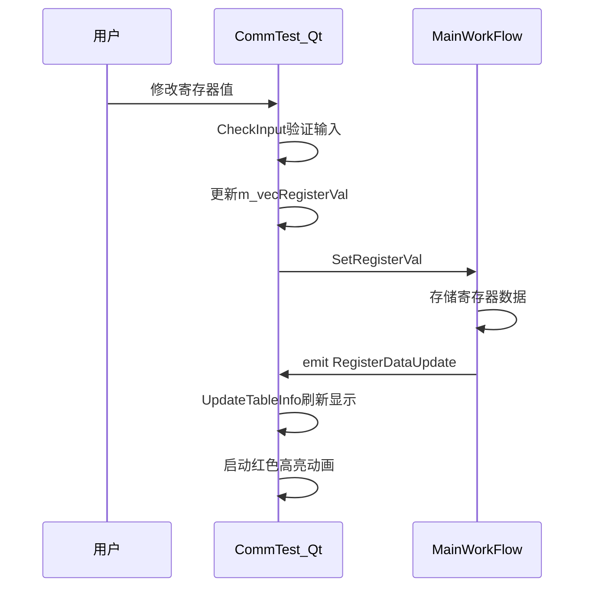

# 图形用户界面

<cite>
**本文档引用文件**   
- [CommTest_Qt.h](file://CommTest_Qt/Gui/CommTest_Qt.h)
- [CommTest_Qt.cpp](file://CommTest_Qt/Gui/CommTest_Qt.cpp)
- [SubMainWindow.h](file://CommTest_Qt/Gui/SubMainWindow.h)
- [SubMainWindow.cpp](file://CommTest_Qt/Gui/SubMainWindow.cpp)
- [SimulationPlatform.h](file://CommTest_Qt/Gui/SimulationPlatform.h)
- [SimulationPlatform.cpp](file://CommTest_Qt/Gui/SimulationPlatform.cpp)
- [MainWorkFlow.h](file://CommTest_Qt/MainFlow/MainWorkFlow.h)
- [MainWorkFlow.cpp](file://CommTest_Qt/MainFlow/MainWorkFlow.cpp)
- [CommTest_Qt.ui](file://CommTest_Qt/Gui/CommTest_Qt.ui)
</cite>

## 目录
1. [主窗口布局与功能](#主窗口布局与功能)
2. [轻量级小窗口模式](#轻量级小窗口模式)
3. [PLC行为模拟平台](#plc行为模拟平台)
4. [数据同步机制](#数据同步机制)
5. [界面交互与状态更新](#界面交互与状态更新)

## 主窗口布局与功能

主窗口CommTest_Qt采用Qt Widgets构建，整体布局分为三大功能区域：左侧通信控制区、中央寄存器数据显示区和右侧操作控制区。

左侧通信控制区包含服务器设置和通信日志显示功能。服务器设置面板允许用户配置IP地址、端口号和通信协议类型（支持基恩士PC-LINK上位链路协议和三菱MC协议二进制通信）。用户可通过"打开链接"按钮建立或关闭TCP连接，连接状态会实时更新按钮文本。通信日志显示区采用QTextEdit控件，可选择ASCII码或十六进制格式显示收发数据，并提供"清空日志"按钮清除历史记录。

中央寄存器数据显示区是核心监控区域，使用QTableWidget实现10列21行的表格布局，每两列构成一组"地址-值"单元格。用户可通过"显示地址"输入框指定起始寄存器地址，系统自动计算并显示后续地址。数据类型下拉框支持字符、单字、双字、单精度和双精度等多种数据类型显示转换。数据格式可通过单选按钮选择十进制或十六进制显示。

右侧操作控制区包含协议配置面板和控制按钮。协议配置面板提供通信协议选择功能，支持多种工业通信协议。控制按钮区域集成了脚本执行和编辑功能，包含6组"执行脚本"和"编辑脚本"按钮，分别对应LuaFile1.lua至LuaFile6.lua六个脚本文件。每个脚本还配有循环执行启用复选框，允许用户配置脚本的执行模式。

**Section sources**
- [CommTest_Qt.ui](file://CommTest_Qt/Gui/CommTest_Qt.ui#L1-L800)
- [CommTest_Qt.h](file://CommTest_Qt/Gui/CommTest_Qt.h#L22-L23)
- [CommTest_Qt.cpp](file://CommTest_Qt/Gui/CommTest_Qt.cpp#L703-L751)

## 轻量级小窗口模式

SubMainWindow类提供轻量级小窗口模式，便于用户进行快速操作和多屏监控。该小窗口继承自QDialog，设计为独立的对话框窗口，包含6个功能按钮和一个"退出小窗"按钮。

小窗口的6个按钮文本内容从主窗口的脚本名称输入框（edit_ScriptName_1至edit_ScriptName_6）获取，通过setButtonTexts方法动态设置。当用户点击主窗口的"最小化"按钮时，主窗口会收集当前脚本名称并传递给小窗口，然后隐藏主窗口并显示小窗口。这种设计实现了界面的快速切换，特别适合在多显示器环境中使用，用户可以在主开发界面和简洁操作界面之间灵活切换。

小窗口的"退出小窗"按钮连接了特殊的信号槽机制：点击后会隐藏小窗口并发射showMainWindow信号，通知主窗口重新显示。这种双向通信机制确保了窗口状态的同步。此外，小窗口重写了closeEvent方法，当用户直接关闭小窗口时，会调用qApp->quit()退出整个应用程序，保证了程序生命周期的一致性。

**Section sources**
- [SubMainWindow.h](file://CommTest_Qt/Gui/SubMainWindow.h#L9-L35)
- [SubMainWindow.cpp](file://CommTest_Qt/Gui/SubMainWindow.cpp#L1-L45)
- [CommTest_Qt.cpp](file://CommTest_Qt/Gui/CommTest_Qt.cpp#L196-L211)

## PLC行为模拟平台

SimulationPlatform类实现了PLC行为的可视化模拟功能，为用户提供直观的设备状态监控。该平台继承自QWidget，包含一个画布区域和多个控制组，能够实时显示目标平台、对象平台和两个Mark点的位置与姿态。

平台的核心功能包括：目标平台（蓝色）和对象平台（绿色）的绝对/相对位置移动控制，支持X、Y坐标和角度参数设置；Mark1和Mark2的独立位置控制，可选择是否跟随目标平台或对象平台；以及画布显示位置的快速定位功能，支持左上、右上、左下、右下四个屏幕角落的快速移动。

平台通过SetRealTimePlatformAbs和SetRealTimePlatformRelative等公共接口接收外部控制指令，更新实时平台的位置。绘图功能由内部的CanvasWidget实现，通过重写paintEvent方法，在画布上绘制坐标系、平台圆圈和方向十字线。平台支持动态缩放，根据屏幕分辨率自动调整显示比例，确保在不同分辨率下都能获得良好的视觉效果。用户还可以通过控制面板调整产品尺寸和缩放比，适应不同的应用场景。

**Section sources**
- [SimulationPlatform.h](file://CommTest_Qt/Gui/SimulationPlatform.h#L31-L132)
- [SimulationPlatform.cpp](file://CommTest_Qt/Gui/SimulationPlatform.cpp#L62-L679)
- [CommTest_Qt.cpp](file://CommTest_Qt/Gui/CommTest_Qt.cpp#L183-L189)

## 数据同步机制

GUI界面通过Qt的信号槽机制与MainWorkFlow进行高效的数据同步，实现了数据的实时刷新和状态更新。MainWorkFlow作为核心工作流类，采用单例模式设计，确保整个应用程序中只有一个实例，通过InitialWorkFlow和ReleaseWorkFlow静态方法进行实例的创建和释放。

数据同步主要通过以下信号实现：MainWorkFlow的RegisterDataUpdate信号在寄存器数据发生变化时发射，连接到CommTest_Qt的UpdateTableInfo槽函数，触发表格数据的刷新；commLogRecord信号用于转发通信日志，dataReceived和dataSend信号分别处理接收和发送的数据记录。这些信号连接在InitialSignalConnect方法中建立，确保了GUI与业务逻辑的松耦合。

寄存器数据的读写通过GetRegisterVal和SetRegisterVal方法实现，支持int16_t、int32_t、float、double等多种数据类型。当用户修改表格中的寄存器值时，系统会通过UpdateRegisterVals方法将新值写入MainWorkFlow，并触发数据变化信号。这种双向数据绑定机制确保了界面显示与内部数据的一致性，同时通过原子操作保证了多线程环境下的数据安全。

**Section sources**
- [MainWorkFlow.h](file://CommTest_Qt/MainFlow/MainWorkFlow.h#L30-L119)
- [MainWorkFlow.cpp](file://CommTest_Qt/MainFlow/MainWorkFlow.cpp#L1-L544)
- [CommTest_Qt.cpp](file://CommTest_Qt/Gui/CommTest_Qt.cpp#L364-L407)

## 界面交互与状态更新

界面实现了丰富的交互功能和状态更新机制，提升了用户体验。数据表格的单元格编辑采用双重验证机制：首先通过QLineEdit的输入验证器限制输入内容，然后在UpdateRegisterVals方法中进行语义验证。当用户修改寄存器值后，系统会通过CheckInput系列方法验证输入的合法性，包括数值范围、十六进制格式等，并在验证失败时保持原值。

状态指示更新采用视觉反馈机制，当表格单元格的值发生变化时，会触发itemChanged信号，启动一个短暂的红色高亮动画，持续100毫秒后恢复原色。这一设计让用户能够清晰地看到哪些数据被修改，增强了操作的可追溯性。动画效果通过QTimer实现，每个单元格对应一个独立的定时器，避免了闪烁冲突。

异常提示通过通信日志区域实现，当连接失败或脚本执行出错时，系统会在日志中追加相应的错误信息。例如，点击"打开链接"按钮时，如果连接失败，会显示"打开连接失败!"的提示；执行Lua脚本失败时，会显示"执行Lua脚本失败!"的提示。这些提示信息采用追加方式显示，保留了历史记录，便于用户排查问题。

**Diagram sources**
- [CommTest_Qt.h](file://CommTest_Qt/Gui/CommTest_Qt.h#L102-L113)
- [MainWorkFlow.h](file://CommTest_Qt/MainFlow/MainWorkFlow.h#L60-L62)
- [CommTest_Qt.cpp](file://CommTest_Qt/Gui/CommTest_Qt.cpp#L853-L967)

**Section sources**
- [CommTest_Qt.cpp](file://CommTest_Qt/Gui/CommTest_Qt.cpp#L216-L270)
- [CommTest_Qt.cpp](file://CommTest_Qt/Gui/CommTest_Qt.cpp#L971-L1000)
- [MainWorkFlow.cpp](file://CommTest_Qt/MainFlow/MainWorkFlow.cpp#L394-L401)