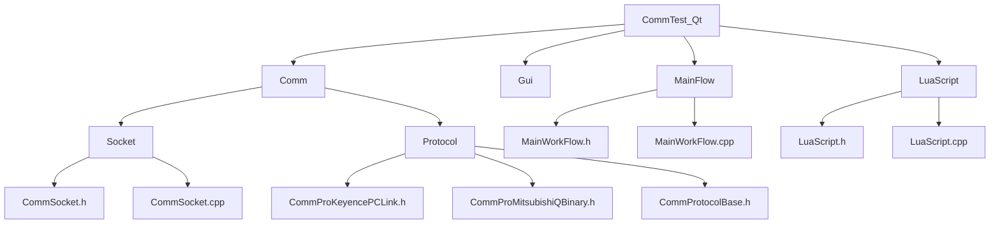
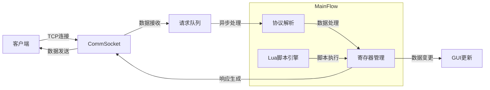
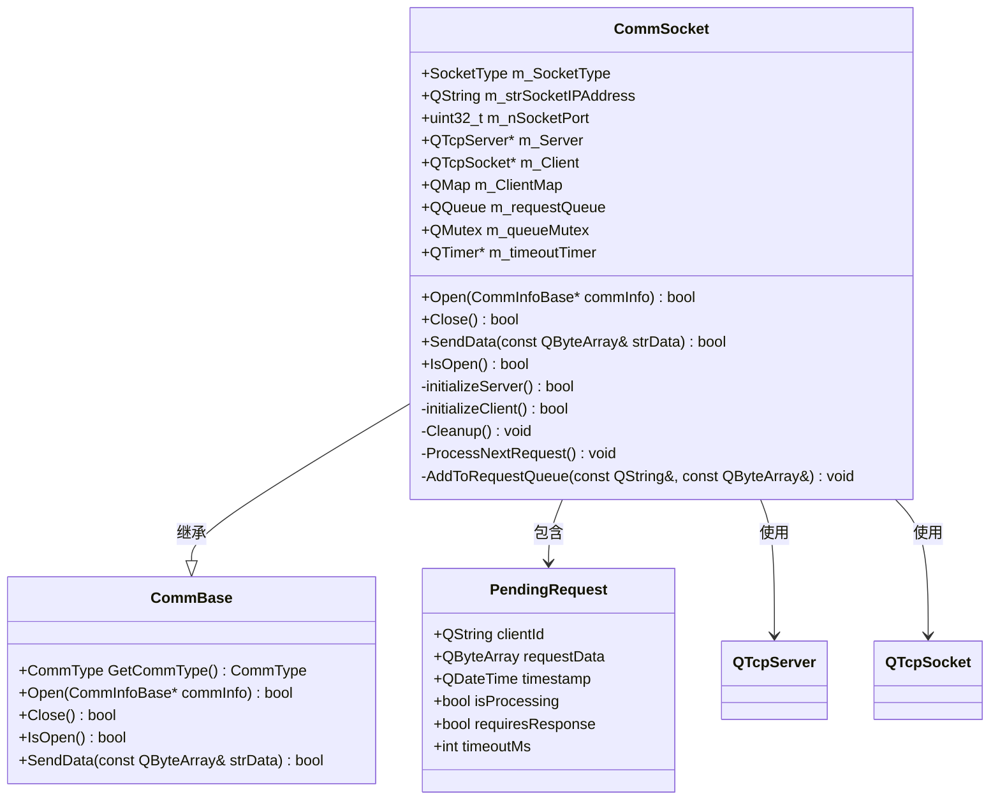
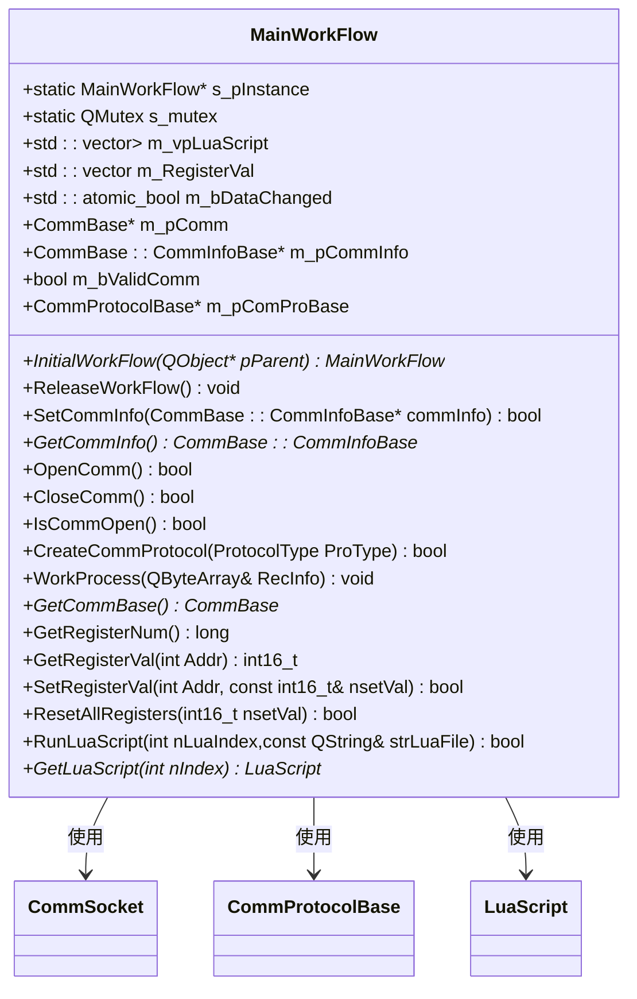
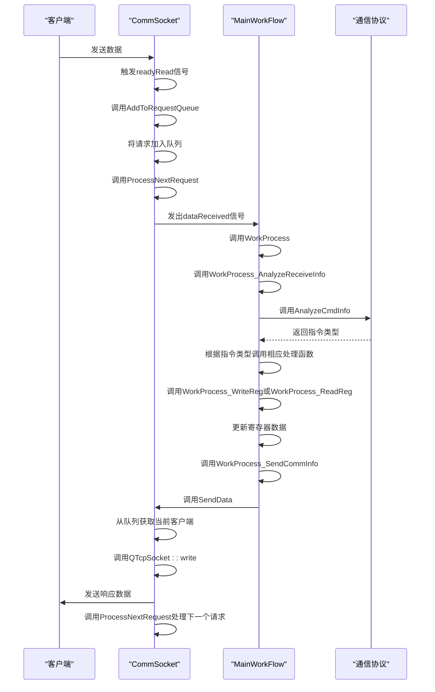
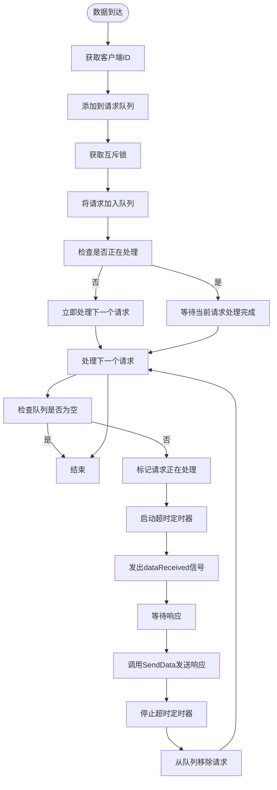
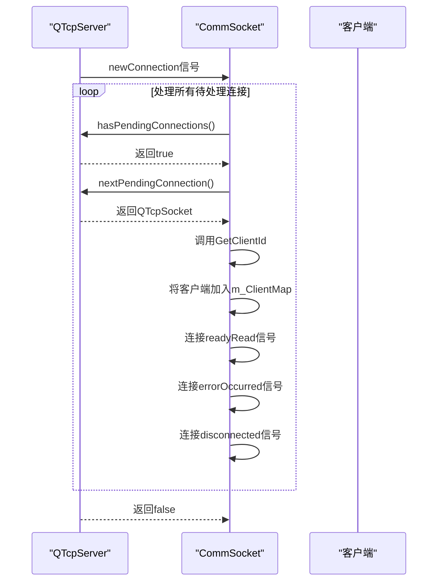
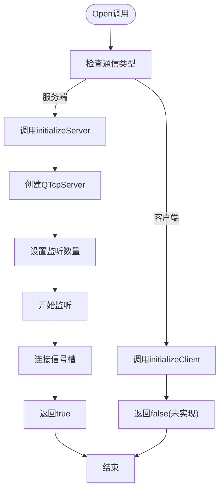
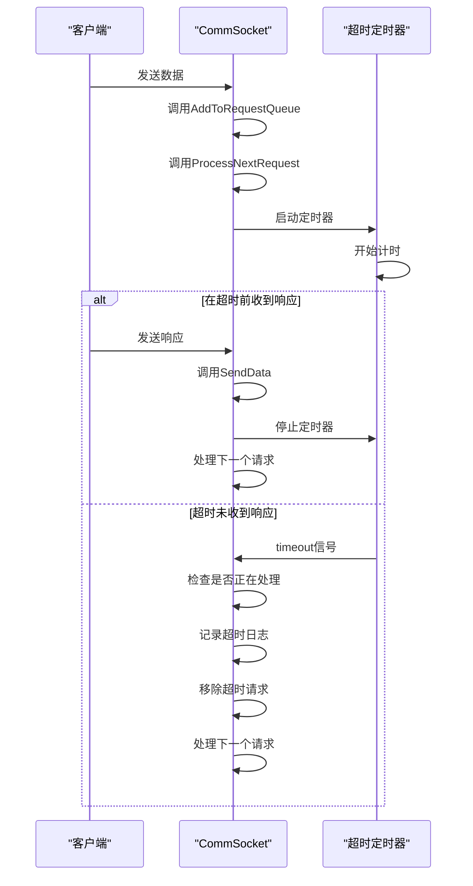

# 网络通信模式

<cite>
**本文档引用文件**   
- [CommSocket.h](file://CommTest_Qt/Comm/Socket/CommSocket.h)
- [CommSocket.cpp](file://CommTest_Qt/Comm/Socket/CommSocket.cpp)
- [MainWorkFlow.h](file://CommTest_Qt/MainFlow/MainWorkFlow.h)
- [MainWorkFlow.cpp](file://CommTest_Qt/MainFlow/MainWorkFlow.cpp)
- [CommBase.h](file://CommTest_Qt/Comm/CommBase.h)
- [CommProtocolBase.h](file://CommTest_Qt/Comm/Protocol/CommProtocolBase.h)
- [CommProMitsubishiQBinary.h](file://CommTest_Qt/Comm/Protocol/CommProMitsubishiQBinary.h)
- [CommProKeyencePCLink.h](file://CommTest_Qt/Comm/Protocol/CommProKeyencePCLink.h)
</cite>

## 目录
1. [项目结构](#项目结构)
2. [核心组件分析](#核心组件分析)
3. [通信架构概述](#通信架构概述)
4. [详细组件分析](#详细组件分析)
5. [通信调度流程](#通信调度流程)
6. [数据包队列机制](#数据包队列机制)
7. [服务端与客户端模式](#服务端与客户端模式)
8. [错误处理与超时机制](#错误处理与超时机制)
9. [性能优化建议](#性能优化建议)
10. [网络抓包分析示例](#网络抓包分析示例)

## 项目结构

**图示来源**
- [CommSocket.h](file://CommTest_Qt/Comm/Socket/CommSocket.h)
- [MainWorkFlow.h](file://CommTest_Qt/MainFlow/MainWorkFlow.h)
- [CommProtocolBase.h](file://CommTest_Qt/Comm/Protocol/CommProtocolBase.h)

**本节来源**
- [CommSocket.h](file://CommTest_Qt/Comm/Socket/CommSocket.h)
- [MainWorkFlow.h](file://CommTest_Qt/MainFlow/MainWorkFlow.h)

## 核心组件分析

本系统基于Qt框架构建，核心通信功能由`CommSocket`类实现，该类继承自`CommBase`基类，通过`QTcpSocket`和`QTcpServer`实现TCP/IP通信。`MainWorkFlow`类作为主工作流控制器，协调通信、协议解析和数据处理。

`CommSocket`类支持服务端和客户端两种通信模式，通过`SocketType`枚举区分。通信参数通过`SocketCommInfo`结构体配置，包含IP地址、端口号和监听数量等关键信息。

**本节来源**
- [CommSocket.h](file://CommTest_Qt/Comm/Socket/CommSocket.h#L14-L107)
- [CommBase.h](file://CommTest_Qt/Comm/CommBase.h#L3-L57)

## 通信架构概述

**图示来源**
- [CommSocket.h](file://CommTest_Qt/Comm/Socket/CommSocket.h)
- [MainWorkFlow.h](file://CommTest_Qt/MainFlow/MainWorkFlow.h)
- [CommProtocolBase.h](file://CommTest_Qt/Comm/Protocol/CommProtocolBase.h)

**本节来源**
- [CommSocket.h](file://CommTest_Qt/Comm/Socket/CommSocket.h#L13-L107)
- [MainWorkFlow.h](file://CommTest_Qt/MainFlow/MainWorkFlow.h#L29-L112)

## 详细组件分析

### CommSocket类分析

`CommSocket`类是网络通信的核心实现，封装了TCP连接管理、数据收发和错误处理功能。

**图示来源**
- [CommSocket.h](file://CommTest_Qt/Comm/Socket/CommSocket.h#L13-L107)
- [CommSocket.cpp](file://CommTest_Qt/Comm/Socket/CommSocket.cpp#L1-L342)

**本节来源**
- [CommSocket.h](file://CommTest_Qt/Comm/Socket/CommSocket.h#L13-L107)
- [CommSocket.cpp](file://CommTest_Qt/Comm/Socket/CommSocket.cpp#L1-L342)

### MainWorkFlow类分析

`MainWorkFlow`类作为系统主控制器，采用单例模式实现，负责协调通信、协议解析和数据处理。

**图示来源**
- [MainWorkFlow.h](file://CommTest_Qt/MainFlow/MainWorkFlow.h#L29-L112)
- [MainWorkFlow.cpp](file://CommTest_Qt/MainFlow/MainWorkFlow.cpp#L1-L544)

**本节来源**
- [MainWorkFlow.h](file://CommTest_Qt/MainFlow/MainWorkFlow.h#L29-L112)
- [MainWorkFlow.cpp](file://CommTest_Qt/MainFlow/MainWorkFlow.cpp#L1-L544)

## 通信调度流程

系统采用事件驱动的异步通信模型，通信调度流程如下：

**图示来源**
- [CommSocket.cpp](file://CommTest_Qt/Comm/Socket/CommSocket.cpp#L85-L92)
- [MainWorkFlow.cpp](file://CommTest_Qt/MainFlow/MainWorkFlow.cpp#L323-L369)
- [CommSocket.cpp](file://CommTest_Qt/Comm/Socket/CommSocket.cpp#L216-L276)

**本节来源**
- [CommSocket.cpp](file://CommTest_Qt/Comm/Socket/CommSocket.cpp#L85-L92)
- [MainWorkFlow.cpp](file://CommTest_Qt/MainFlow/MainWorkFlow.cpp#L323-L369)

## 数据包队列机制

`CommSocket`类通过数据包队列机制保证消息有序性和线程安全，防止数据丢失或阻塞。

**图示来源**
- [CommSocket.h](file://CommTest_Qt/Comm/Socket/CommSocket.h#L84-L91)
- [CommSocket.cpp](file://CommTest_Qt/Comm/Socket/CommSocket.cpp#L278-L299)
- [CommSocket.cpp](file://CommTest_Qt/Comm/Socket/CommSocket.cpp#L302-L334)

**本节来源**
- [CommSocket.h](file://CommTest_Qt/Comm/Socket/CommSocket.h#L84-L91)
- [CommSocket.cpp](file://CommTest_Qt/Comm/Socket/CommSocket.cpp#L278-L299)

## 服务端与客户端模式

### 服务端模式

服务端模式下，`CommSocket`类使用`QTcpServer`监听指定端口，管理多个客户端连接。

**图示来源**
- [CommSocket.cpp](file://CommTest_Qt/Comm/Socket/CommSocket.cpp#L69-L118)
- [CommSocket.h](file://CommTest_Qt/Comm/Socket/CommSocket.h#L96-L97)

**本节来源**
- [CommSocket.cpp](file://CommTest_Qt/Comm/Socket/CommSocket.cpp#L69-L118)

### 客户端模式

客户端模式下，`CommSocket`类使用`QTcpSocket`与真实PLC设备建立通信。

**图示来源**
- [CommSocket.cpp](file://CommTest_Qt/Comm/Socket/CommSocket.cpp#L172-L198)
- [CommSocket.cpp](file://CommTest_Qt/Comm/Socket/CommSocket.cpp#L129-L132)

**本节来源**
- [CommSocket.cpp](file://CommTest_Qt/Comm/Socket/CommSocket.cpp#L172-L198)

## 错误处理与超时机制

系统实现了完善的错误处理和超时机制，确保通信的可靠性。

**图示来源**
- [CommSocket.cpp](file://CommTest_Qt/Comm/Socket/CommSocket.cpp#L14-L35)
- [CommSocket.cpp](file://CommTest_Qt/Comm/Socket/CommSocket.cpp#L278-L299)
- [CommSocket.cpp](file://CommTest_Qt/Comm/Socket/CommSocket.cpp#L302-L334)

**本节来源**
- [CommSocket.cpp](file://CommTest_Qt/Comm/Socket/CommSocket.cpp#L14-L35)

## 性能优化建议

1. **连接池优化**：对于频繁连接的场景，建议实现连接池机制，避免频繁创建和销毁连接。
2. **批量处理**：对于大量小数据包的场景，可以考虑批量处理，减少网络开销。
3. **线程优化**：对于高并发场景，可以考虑将数据处理逻辑放到独立线程中执行。
4. **内存优化**：合理设置缓冲区大小，避免内存浪费。
5. **协议优化**：根据实际需求选择合适的通信协议，减少协议开销。

**本节来源**
- [CommSocket.h](file://CommTest_Qt/Comm/Socket/CommSocket.h)
- [MainWorkFlow.h](file://CommTest_Qt/MainFlow/MainWorkFlow.h)

## 网络抓包分析示例

当遇到连接失败或超时等常见问题时，可以通过网络抓包进行诊断：

1. **连接失败**：检查TCP三次握手是否完成，确认服务器端口是否开放。
2. **数据丢失**：检查TCP序列号是否连续，确认是否有丢包现象。
3. **超时问题**：检查数据包往返时间，确认网络延迟是否过高。
4. **协议错误**：检查应用层数据格式是否符合协议规范。

通过Wireshark等工具抓包分析，可以直观地看到通信过程中的数据交互，帮助快速定位问题。

**本节来源**
- [CommSocket.cpp](file://CommTest_Qt/Comm/Socket/CommSocket.cpp)
- [MainWorkFlow.cpp](file://CommTest_Qt/MainFlow/MainWorkFlow.cpp)