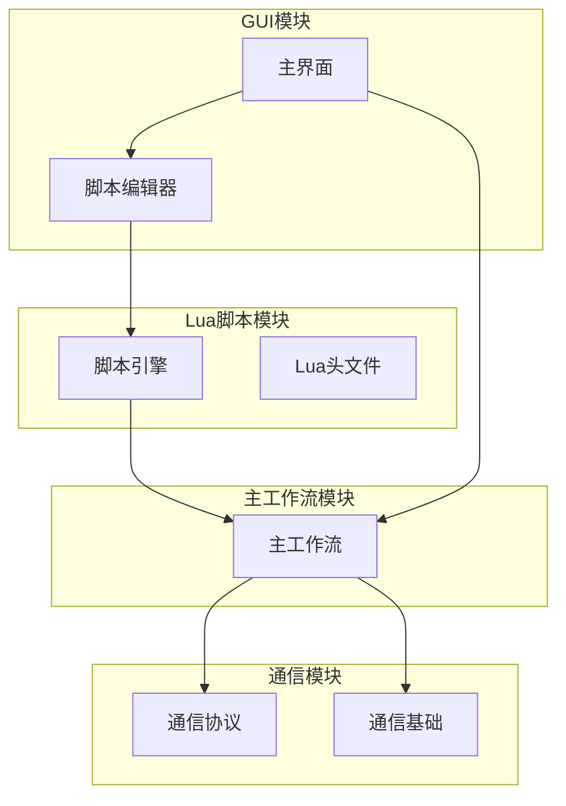
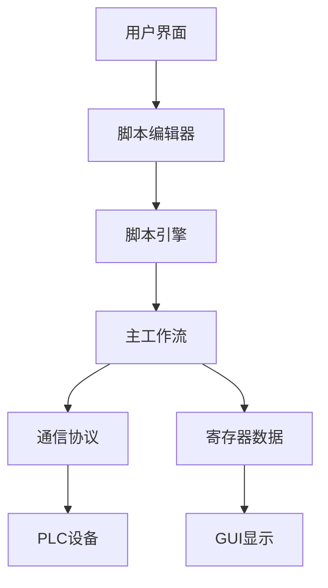
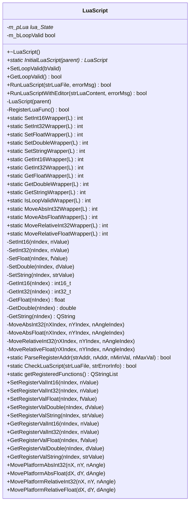
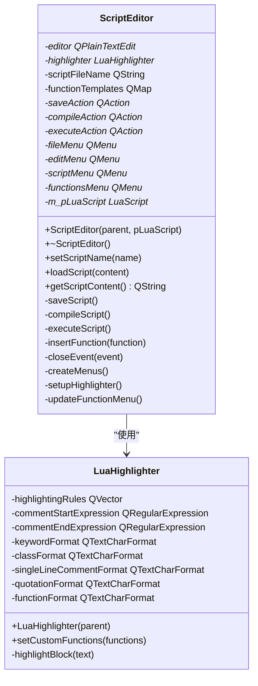
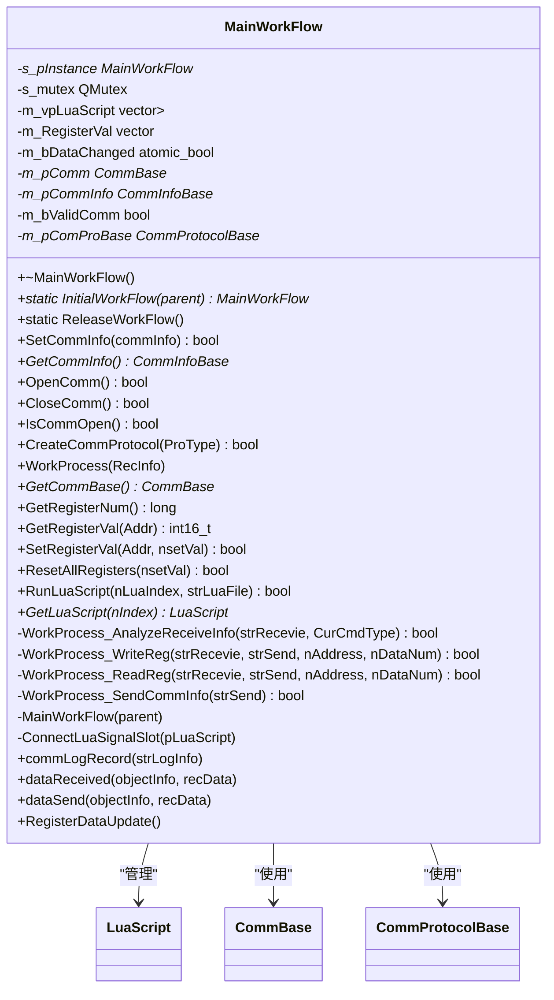
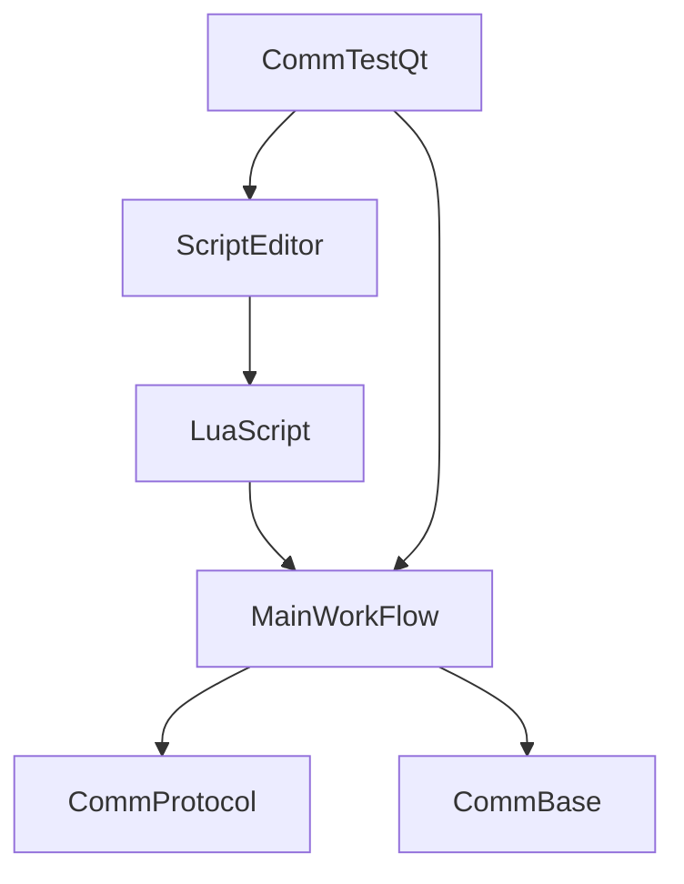

# 自动化测试

<cite>
**本文档引用文件**  
- [LuaScript.h](file://CommTest_Qt/LuaScript/LuaScript.h)
- [LuaScript.cpp](file://CommTest_Qt/LuaScript/LuaScript.cpp)
- [ScriptEditor.h](file://CommTest_Qt/Gui/ScriptEditor.h)
- [ScriptEditor.cpp](file://CommTest_Qt/Gui/ScriptEditor.cpp)
- [MainWorkFlow.h](file://CommTest_Qt/MainFlow/MainWorkFlow.h)
- [MainWorkFlow.cpp](file://CommTest_Qt/MainFlow/MainWorkFlow.cpp)
- [lua.h](file://Lua/Include/lua.h)
</cite>

## 目录
1. [引言](#引言)
2. [项目结构](#项目结构)
3. [核心组件](#核心组件)
4. [架构概述](#架构概述)
5. [详细组件分析](#详细组件分析)
6. [依赖分析](#依赖分析)
7. [性能考虑](#性能考虑)
8. [故障排除指南](#故障排除指南)
9. [结论](#结论)

## 引言
本文档详细阐述了基于Lua脚本引擎的自动化测试功能。系统通过LuaScript类封装Lua C API，实现脚本加载、执行、错误捕获及与C++对象（如MainWorkFlow）的数据交互。ScriptEditor提供语法高亮、执行控制（运行/停止/循环）和输出日志功能，支持用户编写自动化测试脚本。文档结合示例脚本展示如何调用registerRead、registerWrite等接口实现寄存器批量读写和逻辑判断，并解释脚本执行线程管理、超时控制和异常恢复机制，确保测试稳定性。最后指导开发者如何编写高效、可维护的测试脚本。

## 项目结构
项目采用模块化设计，主要分为通信模块、GUI模块、Lua脚本模块和主工作流模块。Lua脚本引擎作为自动化测试的核心，通过MainWorkFlow单例管理多个Lua虚拟机实例，实现与PLC寄存器的交互。

**图源**  
- [MainWorkFlow.h](file://CommTest_Qt/MainFlow/MainWorkFlow.h#L30-L112)
- [LuaScript.h](file://CommTest_Qt/LuaScript/LuaScript.h#L7-L140)
- [ScriptEditor.h](file://CommTest_Qt/Gui/ScriptEditor.h#L17-L63)

**本节源**  
- [MainWorkFlow.h](file://CommTest_Qt/MainFlow/MainWorkFlow.h#L26)
- [LuaScript.h](file://CommTest_Qt/LuaScript/LuaScript.h#L5)
- [ScriptEditor.h](file://CommTest_Qt/Gui/ScriptEditor.h#L4)

## 核心组件
系统核心组件包括LuaScript类、ScriptEditor类和MainWorkFlow类。LuaScript类封装Lua C API，提供脚本执行环境；ScriptEditor类提供用户友好的脚本编辑界面；MainWorkFlow类作为系统核心，管理通信、寄存器数据和多个Lua脚本实例。

**本节源**  
- [LuaScript.h](file://CommTest_Qt/LuaScript/LuaScript.h#L7-L140)
- [ScriptEditor.h](file://CommTest_Qt/Gui/ScriptEditor.h#L17-L63)
- [MainWorkFlow.h](file://CommTest_Qt/MainFlow/MainWorkFlow.h#L30-L112)

## 架构概述
系统采用分层架构，上层为GUI界面，中层为脚本引擎，底层为通信协议。MainWorkFlow作为核心控制器，协调各模块工作。Lua脚本通过信号槽机制与C++对象交互，实现对寄存器的读写操作。

**图源**  
- [MainWorkFlow.cpp](file://CommTest_Qt/MainFlow/MainWorkFlow.cpp#L9-L34)
- [LuaScript.cpp](file://CommTest_Qt/LuaScript/LuaScript.cpp#L57-L65)
- [ScriptEditor.cpp](file://CommTest_Qt/Gui/ScriptEditor.cpp#L25-L30)

## 详细组件分析

### LuaScript类分析
LuaScript类是Lua脚本引擎的核心，封装了Lua C API，提供脚本执行环境。

**图源**  
- [LuaScript.h](file://CommTest_Qt/LuaScript/LuaScript.h#L7-L140)
- [LuaScript.cpp](file://CommTest_Qt/LuaScript/LuaScript.cpp#L57-L132)

**本节源**  
- [LuaScript.h](file://CommTest_Qt/LuaScript/LuaScript.h#L7-L140)
- [LuaScript.cpp](file://CommTest_Qt/LuaScript/LuaScript.cpp#L57-L743)

### ScriptEditor类分析
ScriptEditor类提供脚本编辑功能，包括语法高亮、代码补全和执行控制。

**图源**  
- [ScriptEditor.h](file://CommTest_Qt/Gui/ScriptEditor.h#L17-L63)
- [ScriptEditor.cpp](file://CommTest_Qt/Gui/ScriptEditor.cpp#L25-L30)

**本节源**  
- [ScriptEditor.h](file://CommTest_Qt/Gui/ScriptEditor.h#L17-L95)
- [ScriptEditor.cpp](file://CommTest_Qt/Gui/ScriptEditor.cpp#L25-L247)

### MainWorkFlow类分析
MainWorkFlow类作为系统核心，管理通信、寄存器数据和多个Lua脚本实例。

**图源**  
- [MainWorkFlow.h](file://CommTest_Qt/MainFlow/MainWorkFlow.h#L30-L112)
- [MainWorkFlow.cpp](file://CommTest_Qt/MainFlow/MainWorkFlow.cpp#L9-L34)

**本节源**  
- [MainWorkFlow.h](file://CommTest_Qt/MainFlow/MainWorkFlow.h#L30-L112)
- [MainWorkFlow.cpp](file://CommTest_Qt/MainFlow/MainWorkFlow.cpp#L9-L432)

## 依赖分析
系统各模块之间存在明确的依赖关系。MainWorkFlow依赖LuaScript和通信模块，ScriptEditor依赖LuaScript，形成清晰的调用链。

**图源**  
- [MainWorkFlow.h](file://CommTest_Qt/MainFlow/MainWorkFlow.h#L13)
- [ScriptEditor.h](file://CommTest_Qt/Gui/ScriptEditor.h#L15)
- [LuaScript.h](file://CommTest_Qt/LuaScript/LuaScript.h#L5)

**本节源**  
- [MainWorkFlow.h](file://CommTest_Qt/MainFlow/MainWorkFlow.h#L8-L13)
- [ScriptEditor.h](file://CommTest_Qt/Gui/ScriptEditor.h#L14-L15)
- [LuaScript.h](file://CommTest_Qt/LuaScript/LuaScript.h#L4-L5)

## 性能考虑
系统在性能方面进行了多项优化。使用原子变量存储寄存器数据，确保多线程安全；采用单例模式管理MainWorkFlow，避免资源浪费；通过信号槽机制实现模块解耦，提高系统响应速度。

## 故障排除指南
当遇到脚本执行失败时，首先检查脚本语法是否正确，可通过ScriptEditor的编译功能验证。其次确认寄存器地址格式是否符合规范（以'D'开头，后跟数字）。最后检查LuaScript实例是否正确初始化并与MainWorkFlow连接。

**本节源**  
- [LuaScript.cpp](file://CommTest_Qt/LuaScript/LuaScript.cpp#L17-L23)
- [ScriptEditor.cpp](file://CommTest_Qt/Gui/ScriptEditor.cpp#L185-L193)
- [MainWorkFlow.cpp](file://CommTest_Qt/MainFlow/MainWorkFlow.cpp#L415-L424)

## 结论
基于Lua脚本引擎的自动化测试系统设计合理，功能完善。通过LuaScript类封装Lua C API，实现了脚本的安全执行和错误捕获。ScriptEditor提供了友好的用户界面，支持脚本的编写、编译和执行。MainWorkFlow作为核心控制器，协调各模块工作，确保测试流程的稳定运行。开发者可基于此系统编写高效的测试脚本，提高测试自动化水平。