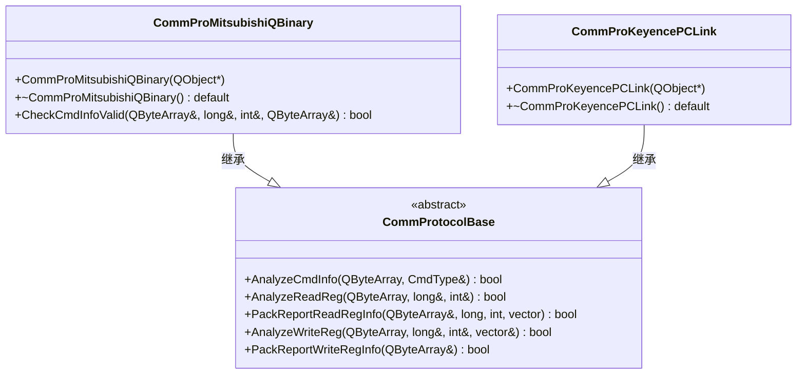
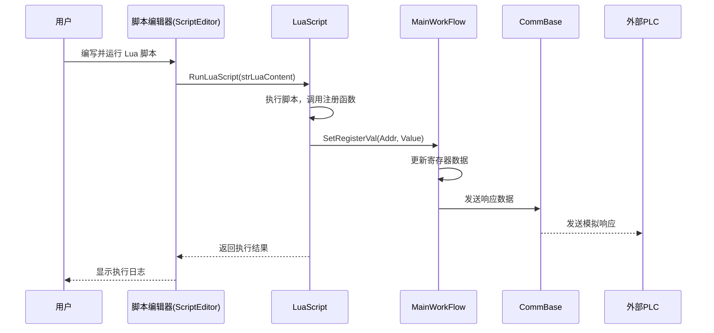
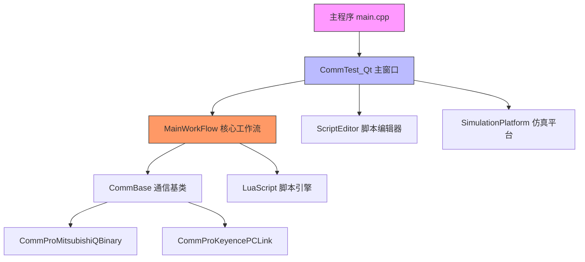

# 项目概述

<cite>
**本文档引用文件**  
- [VS2022项目迁移CMake.md](file://VS2022项目迁移CMake.md)
- [CMakeLists.txt](file://CMakeLists.txt)
- [CommTest_Qt/CMakeLists.txt](file://CommTest_Qt/CMakeLists.txt)
- [CommTest_Qt/main.cpp](file://CommTest_Qt/main.cpp)
- [CommTest_Qt/Comm/Protocol/CommProMitsubishiQBinary.h](file://CommTest_Qt/Comm/Protocol/CommProMitsubishiQBinary.h)
- [CommTest_Qt/Comm/Protocol/CommProKeyencePCLink.h](file://CommTest_Qt/Comm/Protocol/CommProKeyencePCLink.h)
- [CommTest_Qt/LuaScript/LuaScript.h](file://CommTest_Qt/LuaScript/LuaScript.h)
- [CommTest_Qt/Gui/CommTest_Qt.h](file://CommTest_Qt/Gui/CommTest_Qt.h)
- [CommTest_Qt/MainFlow/MainWorkFlow.h](file://CommTest_Qt/MainFlow/MainWorkFlow.h)
</cite>

## 目录
1. [项目简介](#项目简介)
2. [核心功能与应用场景](#核心功能与应用场景)
3. [技术架构与模块设计](#技术架构与模块设计)
4. [CMake迁移动因与优势](#cmake迁移动因与优势)
5. [目标用户与使用场景](#目标用户与使用场景)
6. [项目结构设计原则](#项目结构设计原则)
7. [技术价值总结](#技术价值总结)

## 项目简介

CommTest_Qt_CMake 是一个基于 Qt 框架开发的 PLC 通信测试与仿真平台，旨在为工业自动化领域的设备联调、协议验证和系统测试提供高效、灵活的解决方案。该项目最初基于 Visual Studio 2022 开发，现已成功迁移至 CMake 构建系统，以提升跨平台兼容性、开发灵活性和 AI 辅助编码能力。

平台核心功能包括对三菱 Q 系列和基恩士 KV 系列 PLC 通信协议的模拟与测试，支持通过 Lua 脚本实现自动化测试流程，适用于自动化工程师、测试开发人员在研发、调试和验证阶段进行通信协议仿真与功能测试。

**Section sources**
- [VS2022项目迁移CMake.md](file://VS2022项目迁移CMake.md#L1-L417)
- [CommTest_Qt/main.cpp](file://CommTest_Qt/main.cpp#L1-L32)

## 核心功能与应用场景

### PLC 通信协议支持

本项目实现了对两种主流工业 PLC 通信协议的解析与响应功能：

- **三菱 Q 系列二进制协议**：通过 `CommProMitsubishiQBinary` 类实现，支持 MC 协议 3E 帧格式的指令解析与数据打包，能够模拟 PLC 对读写寄存器指令的响应。
- **基恩士 KV 系列 PCLink 协议**：通过 `CommProKeyencePCLink` 类实现，支持基恩士设备的通信指令解析与数据交互。

这些协议实现均继承自统一的 `CommProtocolBase` 抽象基类，确保接口一致性与扩展性。

**Diagram sources**
- [CommTest_Qt/Comm/Protocol/CommProMitsubishiQBinary.h](file://CommTest_Qt/Comm/Protocol/CommProMitsubishiQBinary.h#L3-L52)
- [CommTest_Qt/Comm/Protocol/CommProKeyencePCLink.h](file://CommTest_Qt/Comm/Protocol/CommProKeyencePCLink.h#L3-L35)
- [CommTest_Qt/Comm/Protocol/CommProtocolBase.h](file://CommTest_Qt/Comm/Protocol/CommProtocolBase.h)

### Lua 脚本自动化测试

项目集成 Lua 脚本引擎，通过 `LuaScript` 类提供脚本执行能力，支持用户编写自动化测试脚本，实现对 PLC 通信的批量读写、状态判断和流程控制。

Lua 脚本可调用平台提供的注册函数，如 `SetInt16`、`GetInt16`、`MoveAbsFloat` 等，实现对虚拟寄存器数据的读写和运动平台的控制，极大提升了测试的灵活性与可重复性。

**Diagram sources**
- [CommTest_Qt/LuaScript/LuaScript.h](file://CommTest_Qt/LuaScript/LuaScript.h#L6-L140)
- [CommTest_Qt/MainFlow/MainWorkFlow.h](file://CommTest_Qt/MainFlow/MainWorkFlow.h#L30-L113)
- [CommTest_Qt/Comm/CommBase.h](file://CommTest_Qt/Comm/CommBase.h)

**Section sources**
- [CommTest_Qt/LuaScript/LuaScript.h](file://CommTest_Qt/LuaScript/LuaScript.h#L1-L146)
- [CommTest_Qt/MainFlow/MainWorkFlow.h](file://CommTest_Qt/MainFlow/MainWorkFlow.h#L1-L119)

## 技术架构与模块设计

项目采用模块化分层架构，核心模块包括：

- **Comm 模块**：封装通信协议与底层通信（Socket），实现协议解析与数据封装。
- **Gui 模块**：基于 Qt Widgets 实现用户界面，包括主窗口、脚本编辑器和仿真平台。
- **MainFlow 模块**：核心业务逻辑控制中心，管理通信流程、寄存器状态和脚本执行。
- **LuaScript 模块**：集成 Lua 脚本引擎，提供自动化测试能力。

主程序入口 `main.cpp` 初始化 Qt 应用，创建主窗口 `CommTest_Qt`，并通过 `MainWorkFlow` 单例管理全局通信与数据状态。

**Diagram sources**
- [CommTest_Qt/main.cpp](file://CommTest_Qt/main.cpp#L1-L32)
- [CommTest_Qt/Gui/CommTest_Qt.h](file://CommTest_Qt/Gui/CommTest_Qt.h#L29-L147)
- [CommTest_Qt/MainFlow/MainWorkFlow.h](file://CommTest_Qt/MainFlow/MainWorkFlow.h#L30-L113)

**Section sources**
- [CommTest_Qt/Gui/CommTest_Qt.h](file://CommTest_Qt/Gui/CommTest_Qt.h#L1-L147)
- [CommTest_Qt/MainFlow/MainWorkFlow.h](file://CommTest_Qt/MainFlow/MainWorkFlow.h#L1-L119)

## CMake迁移动因与优势

根据《VS2022项目迁移CMake.md》文档，项目从 Visual Studio 2022 迁移至 CMake 的主要动因包括：

1. **提升跨平台兼容性**：CMake 支持 Windows、Linux 和 macOS，使项目可在不同操作系统上构建和运行。
2. **增强 vsCode 开发支持**：vsCode 对 CMake 项目有原生良好支持，提供更流畅的代码导航、调试和智能提示体验。
3. **优化 AI 辅助编码**：vsCode 的 AI Coding Agent（如 Copilot）在 CMake 项目中表现优于 VS2022，提升开发效率。
4. **简化构建配置**：CMakeLists.txt 以声明式语法统一管理构建逻辑，相比 .vcxproj 文件更简洁、易维护。

迁移后，项目通过根目录和子目录的 CMakeLists.txt 文件组织构建逻辑，支持多配置（Debug/Release）、自动 MOC/UIC/RCC 处理，并集成 Qt6 模块与 Lua 库依赖。

**Section sources**
- [VS2022项目迁移CMake.md](file://VS2022项目迁移CMake.md#L1-L417)
- [CMakeLists.txt](file://CMakeLists.txt#L1-L50)
- [CommTest_Qt/CMakeLists.txt](file://CommTest_Qt/CMakeLists.txt#L1-L198)

## 目标用户与使用场景

### 目标用户

- **自动化工程师**：用于 PLC 通信协议的仿真测试，验证上位机与 PLC 的数据交互逻辑。
- **测试开发人员**：利用 Lua 脚本编写自动化测试用例，提高测试覆盖率与效率。
- **系统集成商**：在设备联调前进行通信预验证，降低现场调试风险。

### 典型使用场景

- **协议兼容性测试**：模拟不同品牌 PLC 响应，验证上位机软件的协议解析能力。
- **自动化回归测试**：通过 Lua 脚本批量执行读写操作，确保通信功能稳定性。
- **教学与演示**：作为工业通信教学平台，展示 PLC 通信原理与数据交互过程。

## 项目结构设计原则

项目遵循模块化、分层化设计原则：

- **功能模块分离**：通信、GUI、业务逻辑、脚本引擎各司其职，降低耦合度。
- **协议可扩展**：通过继承 `CommProtocolBase` 可轻松添加新 PLC 协议支持。
- **构建系统现代化**：采用 CMake 实现跨平台构建，提升项目可维护性与协作效率。
- **资源统一管理**：Lua 头文件与库文件集中存放，便于依赖管理。

项目结构清晰，便于新开发者快速理解与参与开发。

**Section sources**
- [VS2022项目迁移CMake.md](file://VS2022项目迁移CMake.md#L1-L417)
- [project_structure](file://#project_structure)

## 技术价值总结

CommTest_Qt_CMake 项目通过现代化构建系统与模块化架构，实现了以下技术价值：

- **跨平台能力**：支持多操作系统开发与部署。
- **高效开发体验**：结合 vsCode 与 CMake 提升编码效率。
- **灵活测试能力**：Lua 脚本支持复杂自动化测试场景。
- **高可维护性**：清晰的模块划分与构建配置，便于长期维护与扩展。

该项目不仅是一个实用的 PLC 通信测试工具，也为工业自动化软件的现代化开发提供了良好范例。