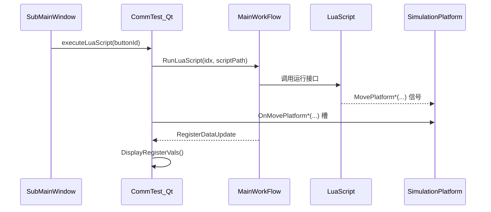
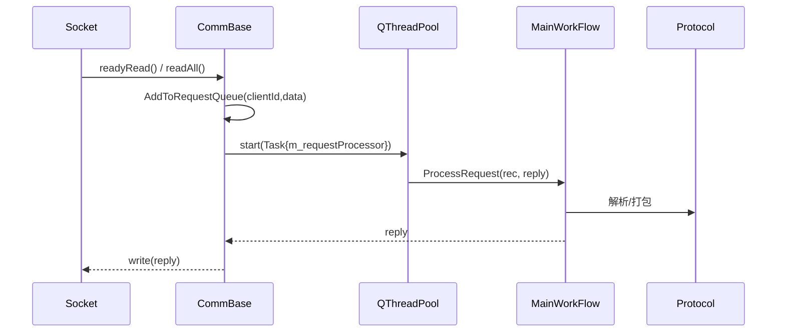
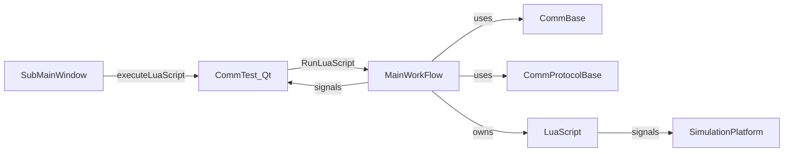

# AGENTS

本仓库是一个基于 Qt 6 的 PLC 模拟器与通信测试项目，采用 CMake 构建。按“Agent（模块/职责单元）”视角，更新各模块职责、协作流程、接口规范与典型场景，确保与当前实现一致。

## 构建 Agent
- 顶层工程：`CommTestSolution` 管理 C++17、并行编译与 Qt 自动处理，添加子目录 `CommTest_Qt`（`CMakeLists.txt:1–50`）。
- 目标与依赖：子工程目标名 `CommTest_Qt`，输出名 `PLC_Simulator`（Debug 追加 `d`），链接 `Qt6::Core/Gui/Widgets/Network/SerialPort` 与 `ScriptRunner.lib`，包含 `Lua/Include`（`CommTest_Qt/CMakeLists.txt:108–173`）。
- 部署与调试：构建后拷贝至 `Bin/x64/`；MSVC 调试器指向发布目录中的产物（`CommTest_Qt/CMakeLists.txt:185–196` 及新增 VS 调试属性）。

## 应用 Agent（UI 主程序）
- 职责：主界面管理寄存器显示、协议选择、脚本编辑与平台可视化；负责连接信号、初始化脚本、触发执行（`Gui/CommTest_Qt.h:29–145`）。
- 接口：
  - `CreateCurrentProtocol()` 选择并创建协议（`Gui/CommTest_Qt.cpp:818–829`）。
  - `OpenScriptEditor(int)` 打开并管理脚本编辑器（`Gui/CommTest_Qt.cpp:596–701`）。
  - 平台控制槽函数系列（`Gui/CommTest_Qt.cpp:1691–1751`）。
- 协作：接收子窗口 `executeLuaScript(int)` 并调用 `MainWorkFlow::RunLuaScript(idx,path)`，异常弹窗与日志记录（`Gui/CommTest_Qt.cpp:179–205`）。

## 工作流 Agent（核心协调）
- 职责：统一管理通信实例、协议解析、寄存器数据与脚本执行；提供线程池处理入口 `ProcessRequest(const QByteArray&, QByteArray&)`（`MainFlow/MainWorkFlow.cpp:379`；`MainFlow/MainWorkFlow.h:59`）。
- 接口：
  - 通信：`OpenComm/CloseComm/IsCommOpen/SetCommInfo`（`MainFlow/MainWorkFlow.h:42–49`）。
  - 协议：`CreateCommProtocol(ProtocolType)`（`MainFlow/MainWorkFlow.h:51–55`）。
  - 寄存器：`GetRegisterNum/GetRegisterVal/SetRegisterVal/ResetAllRegisters`（`MainFlow/MainWorkFlow.h:60–64, 95–104`）。
  - 脚本：`RunLuaScript/GetLuaScript`（`MainFlow/MainWorkFlow.h:66–69`）。
- 信号：`commLogRecord/dataReceived/dataSend/RegisterDataUpdate`（`MainFlow/MainWorkFlow.h:105–113`）。

## 通信 Agent
- 抽象层：`CommBase` 提供统一接口与信号；`CommInfoBase` 描述通信参数（`Comm/CommBase.h:4–58`）。
- Socket 实现：`CommSocket` 支持服务端/客户端，管理连接与请求队列、超时（`Comm/Socket/CommSocket.h:14–108`）。
- 接口规范：
  - `Open(CommInfoBase*)/Close()/IsOpen()/SendData(const QByteArray&)`。
  - 注入处理器：`SetRequestProcessor(std::function<bool(const QByteArray&, QByteArray&)>)`（`Comm/CommBase.h:73`）。
  - 队列与线程池：每端点独立队列串行、端点间并行；`QThreadPool` 执行体在 `CommBase::ProcessNextForEndpoint` 内定义（`Comm/CommBase.cpp:33–75`）。

## 协议 Agent
- 抽象层：`CommProtocolBase` 统一读写指令解析与回复打包；处理方向 `ProcessType`（`Comm/Protocol/CommProtocolBase.h:5–103`）。
- 实现：
  - 三菱 MC 3E（二进制）：`CommProMitsubishiQBinary`（`Comm/Protocol/CommProMitsubishiQBinary.h:20–53`）。
  - 基恩士 PC-Link：`CommProKeyencePCLink`（`Comm/Protocol/CommProKeyencePCLink.h:20–36`）。
- 接口规范：
  - `AnalyzeCmdInfo/AnalyzeReadReg/AnalyzeWriteReg/Packing*` 均以 `QByteArray` 作为载体。

## Lua Agent（脚本扩展）
- 职责：封装 `lua_State`，注册寄存器读写与平台控制函数；提供文件/编辑器脚本执行（`LuaScript/LuaScript.h:7–141`）。
- 接口规范：
  - 运行：`RunLuaScript(file,err)/RunLuaScriptWithEditor(content,err)`；循环控制 `SetLoopValid(bool)`；函数列表查询 `getRegisteredFunctions()`。
  - 平台控制信号：四种移动方式（Abs/Relative × Int32/Float），供主界面处理（`LuaScript.h:134–139`）。
- 依赖：`Lua/Include` 头、`Lua/Lib/ScriptRunner.{lib,dll}`（`CommTest_Qt/CMakeLists.txt:152–173`）。

## GUI Agent（子窗口与平台）
- 子窗口：`SubMainWindow` 提供 6 个按钮，发射 `executeLuaScript(int)` 以触发脚本（`Gui/SubMainWindow.h:20,34–39；Gui/SubMainWindow.cpp:34–40,47–76`）。
- 模拟平台：`SimulationPlatform` 渲染坐标系/平台/Mark 并提供位置控制接口（`Gui/SimulationPlatform.h:31–130`）。
- 脚本编辑器：`ScriptEditor` 文件加载、编辑、保存与内容读取（`Gui/ScriptEditor.h`）。

## 协作流程图

## 典型使用场景示例
- 子窗触发脚本
  - 子窗按钮 1–6 发射 `executeLuaScript(int)`；主界面根据 `buttonId` 选择 `script{Id}.lua` 并执行对应 Lua 实例；异常弹窗提示与日志记录（`Gui/CommTest_Qt.cpp:179–205`）。
- 收发数据处理
  - 通信层接收数据并入队 → 线程池运行注入的处理器（`MainWorkFlow::ProcessRequest`）→ 更新寄存器/打包回复 → 经通信层回发（`CommBase.cpp:33–75；MainWorkFlow.cpp:379`）。
- 平台可视化与寄存器写入
  - Lua 触发平台移动；主界面根据单位幂次转换坐标到双字/浮点寄存器并写入（`Gui/CommTest_Qt.cpp:1754–1858`）。

## 接口规范补充
- 返回值与错误处理：所有 `RunLuaScript/OpenComm/CloseComm` 等返回 `bool` 表示成功；失败时需记录日志并对 UI 进行提示。
- 数据类型与边界：寄存器索引范围校验与 UI 输入合法性检查（`Gui/CommTest_Qt.cpp:971–1271`）。
- 路径约定：默认脚本目录为 `applicationDirPath()/Config/LuaScript/`；子窗按钮对应 `script1.lua`–`script6.lua`。
 - 通信处理器注入时机：在主界面初始化通信后通过 `SetRequestProcessor` 注入，引用 `MainWorkFlow::ProcessRequest`（`Gui/CommTest_Qt.cpp:452–455`）。

## 附：组件关系示意

