# CommTest_Qt——vs2022项目迁移CMake项目

#### 为什么迁移？

1.vs2022项目无法通过vsCode进行开发(**vsCode中开发需要繁琐的配置且不易维护，也无法获得直接使用visual studio 2022进行开发的便利性**)。

2.vs2022的Coding Agent远不如vsCode。于是找寻vsCode C++开发的方式：**CMake**. vsCode对CMake项目的支持非常友好。而且CMake可以根据你的目标平台(windows、Mac、Linux)进行项目的构建，这就意味着一个CMake项目可以**在不同平台进行开发、运行，CMake项目可以轻松实现跨平台**。

[CMake官方地址]([CMake - Upgrade Your Software Build System](https://cmake.org/))

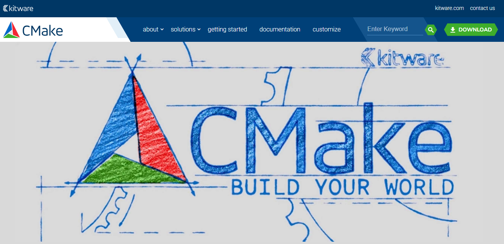

为了方便使用AI Coding，遂将项目迁移到CMake.

**要完成项目迁移，需了解原本的项目结构，并根据原本的项目结构编写CMakelists.txt文件(CMake项目构建时需要的信息全在这里面)**

## 0. 安装CMake

[CMake安装教程]([Windows下CMake 安装攻略（详细图文教程）_cmake安装windows-CSDN博客](https://blog.csdn.net/Natsuago/article/details/145662289))

安装完成后通过命令行查看是否安装成功：**`cmake --version`**


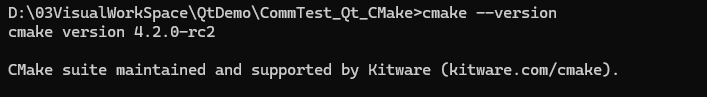


## 1. vs2022项目构成

一般visual studio项目由解决方案(.sln)和项目工程相关文件(.vcxproj、.vcxproj.filters、.vcxproj.user)、项目源码文件(.h、.cpp)、项目资源文件(图片等)构成。

**1 .sln:这是 Visual Studio 解决方案的主入口文件。它本身不包含项目具体的编译设置，而是作为一个容器和协调者，表示一个项目组，通常包含一个或多个项目的所有工程文件信息**。

**2 .vcxproj: 这是单个 C++ 项目的核心定义文件。它包含项目生成所需的所有关键信息：项目依赖、文件列表、项目引用、目标平台、工具集版本、项目类型。主要是告诉MSBuild(vs2022的项目构建器)该如何构建这个项目**

**3 .vcxproj.filters：纯粹用于在 Visual Studio 的解决方案资源管理器中组织源代码文件的虚拟文件夹结构。它定义了 .vcxproj 文件中列出的文件在 IDE 树形视图中如何分组（例如“头文件”、“源文件”、“资源文件”等文件夹）。它不影响编译过程本身。**

**4 .vcxproj.user： 存储特定于本地用户开发环境和特定于这台计算机的设置。这些设置不应该影响项目本身的构建结果（如果项目能在你的机器上构建成功，它也应该能在其他配置正确的机器上构建成功）**

### 1. sln文件


以本项目为例：其sln中内容如下。

主要内容有：

1. sln文件信息描述
   1. sln文件格式版本**Format Version 12.00**：解决方案文件格式版本（VS2013+）
   2. 创建该sln文件的vs版本**Visual Studio Version 17**：创建此方案的 VS 版本（VS2022）
   3. 具体的vs版本号**VisualStudioVersion**：具体的 VS2022 版本号
   4. 最低兼容的vs版本**MinimumVisualStudioVersion**：最低兼容的 VS 版本（VS2010）
2. 项目信息描述
   1. 项目类型GUID**`{8BC9CEB8-8B4A-11D0-8D11-00A0C91BC942}`**
   2. 项目在解决方案中的名称**`"QGuiDisplay"`**
   3. 项目的相对路径**`"QGuiDisplay\QGuiDisplay.vcxproj"`**
   4. 项目唯一标识符（GUID）**`{8CD9FDA6-408F-4EB5-AC4B-FFF51B303B4E}`**
3. 解决方案配置平台
   1. 64位调试配置**`Debug|x64`**
   2. 64位发布配置**`Release|x64`**
4. 项目配置映射
   1. 每行格式均为：**`{项目GUID}.{解决方案配置}.{属性} = {项目配置}`**
      - **`ActiveCfg`**：激活时使用的配置
      - **`Build.0`**：构建时使用的配置（数字表示构建顺序）
5. 在解决方案资源管理器中显示解决方案节点**`HideSolutionNode = FALSE`**
6. 解决方案的唯一标识符**`SolutionGuid`**

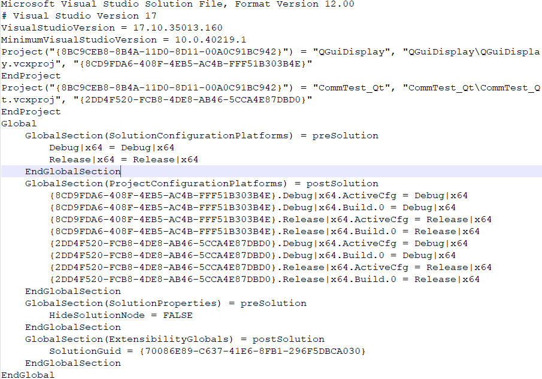


### 2. vcxproj文件

1.  **文件头和项目配置**

   1. **ToolsVersion="17.0"**：使用 MSBuild 17.0（对应 VS2022）
   2. **项目配置**：定义了 Debug|x64 和 Release|x64 两种配置

   

2.  **全局属性**

   1. **ProjectGuid**：项目唯一标识符（与 .sln 中对应）
   2. **Keyword**：标识这是 Qt Visual Studio 项目
   3. **WindowsTargetPlatformVersion**：目标 Windows SDK 版本
   4. **QtMsBuild**：Qt 的 MSBuild 扩展路径

   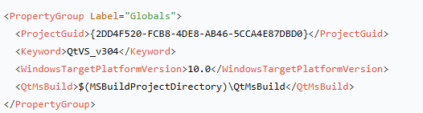

   

3. **导入默认属性和配置特定属性**

   1. **ConfigurationType**：`Application` 表示生成可执行文件
   2. **PlatformToolset**：`v143` 对应 VS2022 工具集
   3. **UseDebugLibraries**：Debug 版本使用调试库
   4. **CharacterSet**：使用 Unicode 字符集

   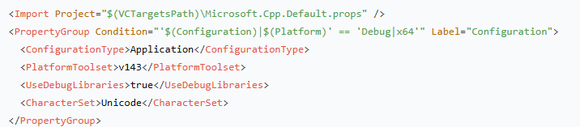

   

1. **Qt 特定配置**

   1. **QtInstall**：使用的 Qt 版本
   2. **QtModules**：项目使用的 Qt 模块
   3. **QtBuildConfig**：构建配置（debug/release）

   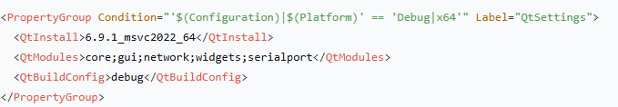

2. **输出目录设置**

   1. **OutDir**：输出目录（可执行文件）
   2. **IntDir**：中间文件目录（.obj 等）
   3. **TargetName**：Debug 版本目标名加 `d` 后缀

   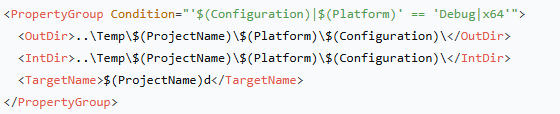

3. **编译和链接设置**

   1. **PostBuildEvent**：构建后复制可执行文件到 Bin 目录
   2. **AdditionalIncludeDirectories**：Lua 包含目录
   3. **AdditionalLibraryDirectories**：Lua 库目录
   4. **AdditionalDependencies**：链接 ScriptRunner.lib

   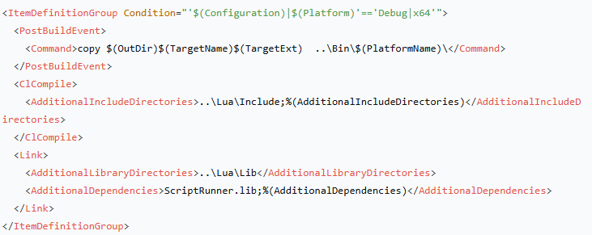

4. **编译器选项**

   1. **MultiProcessorCompilation**：启用多处理器编译
   2. **WarningLevel**：警告级别 3
   3. **SDLCheck**：启用安全开发生命周期检查
   4. **SubSystem**：Windows 子系统（无控制台）
   5. **GenerateDebugInformation**：生成调试信息

   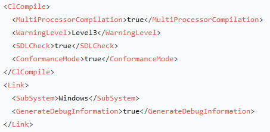

   

5. **源文件列表**

   1. **ClCompile**：C++ 源文件
   2. **QtRcc**：Qt 资源文件
   3. **QtUic**：Qt UI 文件
   4. **QtMoc**：需要 moc 处理的头文件

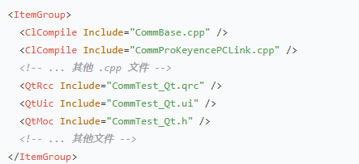


### 3.vcxproj.filters文件

主要包含在解决方案中组织文件关系，比如该项目中的文件关系就是由该文件控制：
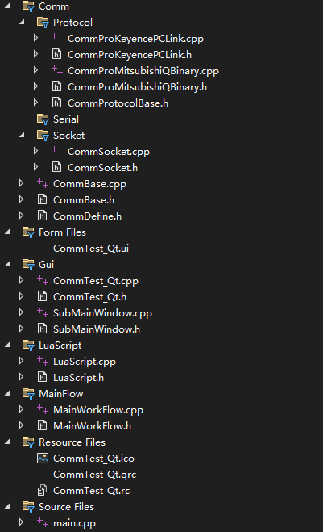


## 2. 编写CMake文件

CMake项目主要由CMakelists.txt、项目源文件构成。CMakelists.txt中包含了项目的所有信息。以已经完成迁移的CommTest_Qt_CMake项目来说明，以下是整个项目的构成：

```text
CommTest_Qt_CMake/
├── CMakeLists.txt                 # 根目录的CMakeLists.txt
├── CommTest_Qt/                   # 子目录，包含一个子项目
│   ├── CMakeLists.txt             # 子项目的CMakeLists.txt
│   ├── ......					   # 其他源文件
├── Lua/                           # 第三方Lua库
│   ├── Include/
│   └── Lib/
└── Bin/                           # 最终输出目录（可执行文件复制到这里）
```

主目录下的CMakelists.txt文件内容如下：
```cmake
cmake_minimum_required(VERSION 3.16)				  #CMake最低版本
project(CommTestSolution VERSION 1.0.0 LANGUAGES CXX) #指定项目的工程名,当前版本(可省略),编译工程需要的语言(C++)

# 设置C++标准,CMake工具链抽象定义，不需要关心编译器是MSVC/GCC/CLang
set(CMAKE_CXX_STANDARD 17)
set(CMAKE_CXX_STANDARD_REQUIRED ON)

# 设置输出目录（保持与原项目一致的结构）
set(CMAKE_ARCHIVE_OUTPUT_DIRECTORY ${CMAKE_BINARY_DIR}/Temp/${PROJECT_NAME}/lib)
set(CMAKE_LIBRARY_OUTPUT_DIRECTORY ${CMAKE_BINARY_DIR}/Temp/${PROJECT_NAME}/lib)
set(CMAKE_RUNTIME_OUTPUT_DIRECTORY ${CMAKE_BINARY_DIR}/Temp/${PROJECT_NAME}/bin)

# 查找Qt包 - 使用与VS项目相同的版本
set(QT_VERSION 6)
find_package(Qt${QT_VERSION} REQUIRED COMPONENTS Core Gui Widgets Network SerialPort) 
#REQUIRED：找不到指定组件时终止配置并报错   COMPONENTS ：指定需要的模块

# 启用Qt自动处理
set(CMAKE_AUTOMOC ON)
set(CMAKE_AUTOUIC ON)
set(CMAKE_AUTORCC ON)

# 添加子项目,再读取CommTest_Qt中的CMakelists.txt
add_subdirectory(CommTest_Qt)
```

具体项目中的CMakelists.txt：

```cmake
set(TARGET_NAME "CommTest_Qt")

# 按原项目过滤器结构组织文件
set(SOURCE_FILES
    main.cpp
)

set(RESOURCE_FILES
    Resource_Files/CommTest_Qt.qrc
    Resource_Files/CommTest_Qt.rc
    Resource_Files/CommTest_Qt.ico
)

set(FORM_FILES
    Gui/CommTest_Qt.ui
)


# Comm 模块
set(COMM_SOURCES
    Comm/CommBase.cpp
)

set(COMM_HEADERS
    Comm/CommBase.h
    Comm/CommDefine.h
)

# Comm\Socket 模块
set(COMM_SOCKET_SOURCES
    Comm/Socket/CommSocket.cpp
)

set(COMM_SOCKET_HEADERS
    Comm/Socket/CommSocket.h
)

# Comm\Serial 模块（可能未来扩展）

# Comm\Protocol 模块
set(COMM_PROTOCOL_SOURCES
    Comm/Protocol/CommProKeyencePCLink.cpp
    Comm/Protocol/CommProMitsubishiQBinary.cpp
)

set(COMM_PROTOCOL_HEADERS
    Comm/Protocol/CommProtocolBase.h
    Comm/Protocol/CommProMitsubishiQBinary.h
    Comm/Protocol/CommProKeyencePCLink.h
)

# Gui 模块
set(GUI_SOURCES
    Gui/CommTest_Qt.cpp
    Gui/SubMainWindow.cpp
)

set(GUI_HEADERS
    Gui/CommTest_Qt.h
    Gui/SubMainWindow.h
)

# MainFlow 模块
set(MAINFLOW_SOURCES
    MainFlow/MainWorkFlow.cpp
)

set(MAINFLOW_HEADERS
    MainFlow/MainWorkFlow.h
)

# LuaScript 模块
set(LUA_SOURCES
    LuaScript/LuaScript.cpp
)

set(LUA_HEADERS
    LuaScript/LuaScript.h
)

# 合并所有文件
set(SOURCES
    ${SOURCE_FILES}
    ${COMM_SOURCES}
    ${COMM_SOCKET_SOURCES}
    ${COMM_PROTOCOL_SOURCES}
    ${GUI_SOURCES}
    ${MAINFLOW_SOURCES}
    ${LUA_SOURCES}
)

set(HEADERS
    ${COMM_HEADERS}
    ${COMM_SOCKET_HEADERS}
    ${COMM_PROTOCOL_HEADERS}
    ${GUI_HEADERS}
    ${MAINFLOW_HEADERS}
    ${LUA_HEADERS}
)

# 创建可执行目标
add_executable(${TARGET_NAME}
    ${SOURCES}
    ${HEADERS}
    ${RESOURCE_FILES}
    ${FORM_FILES}
)

# 设置目标属性
set_target_properties(${TARGET_NAME} PROPERTIES
    OUTPUT_NAME "CommTest_Qt$<$<CONFIG:Debug>:d>"
    WIN32_EXECUTABLE TRUE

#创建详细的 Visual Studio 过滤器
if(MSVC)#(暂只针对vs2022设置过滤器)

source_group("Source Files" FILES ${SOURCE_FILES})
source_group("Resource Files" FILES ${RESOURCE_FILES})
source_group("Form Files" FILES ${FORM_FILES})
source_group("Comm" FILES ${COMM_SOURCES} ${COMM_HEADERS})
source_group("Comm\\\\Socket" FILES ${COMM_SOCKET_SOURCES} ${COMM_SOCKET_HEADERS})
source_group("Comm\\\\Protocol" FILES ${COMM_PROTOCOL_SOURCES} ${COMM_PROTOCOL_HEADERS})
source_group("Gui" FILES ${GUI_SOURCES} ${GUI_HEADERS})
source_group("MainFlow" FILES ${MAINFLOW_SOURCES} ${MAINFLOW_HEADERS})
source_group("LuaScript" FILES ${LUA_SOURCES} ${LUA_HEADERS})

endif() #结束

# 链接Qt库
target_link_libraries(${TARGET_NAME} PRIVATE
    Qt${QT_VERSION}::Core
    Qt${QT_VERSION}::Gui
    Qt${QT_VERSION}::Widgets
    Qt${QT_VERSION}::Network
    Qt${QT_VERSION}::SerialPort
)


# 包含目录
target_include_directories(${TARGET_NAME} PRIVATE
    ${CMAKE_CURRENT_SOURCE_DIR}
	${CMAKE_CURRENT_BINARY_DIR}
    ${CMAKE_CURRENT_SOURCE_DIR}/Gui
    ${CMAKE_CURRENT_SOURCE_DIR}/Comm
    ${CMAKE_CURRENT_SOURCE_DIR}/Comm/Socket
    ${CMAKE_CURRENT_SOURCE_DIR}/Comm/Protocol
    ${CMAKE_CURRENT_SOURCE_DIR}/MainFlow
    ${CMAKE_CURRENT_SOURCE_DIR}/LuaScript
    ${CMAKE_SOURCE_DIR}/Lua/Include
)

# 链接目录和库（Lua相关）
target_link_directories(${TARGET_NAME} PRIVATE
    ${CMAKE_SOURCE_DIR}/Lua/Lib
)

target_link_libraries(${TARGET_NAME} PRIVATE
    ScriptRunner.lib
)

# 设置编译选项（与原项目保持一致）
target_compile_options(${TARGET_NAME} PRIVATE
    $<$<CONFIG:Debug>:/MDd>
    $<$<CONFIG:Release>:/MD>
)

target_compile_definitions(${TARGET_NAME} PRIVATE
    UNICODE
    _UNICODE
)

# 设置链接选项
target_link_options(${TARGET_NAME} PRIVATE
    /SUBSYSTEM:WINDOWS
    $<$<CONFIG:Debug>:/DEBUG>
    $<$<CONFIG:Release>:/OPT:REF /OPT:ICF>
)

# 后期构建步骤：复制到Bin目录
add_custom_command(TARGET ${TARGET_NAME} POST_BUILD
    COMMAND ${CMAKE_COMMAND} -E copy_if_different
        $<TARGET_FILE:${TARGET_NAME}>
        ${CMAKE_SOURCE_DIR}/Bin/x64/
    COMMENT "Copying executable to Bin/x64 directory"
)
```

## 3. CMake项目构建

**当完成以上两个CMakelists.txt文件编写后，CMake项目的创建就基本算是完成了。**若后期需要跨平台使用，还需要根据其他平台测试项目构建。


**现在，可以通过CMake构建vs2022平台下的sln项目了：**

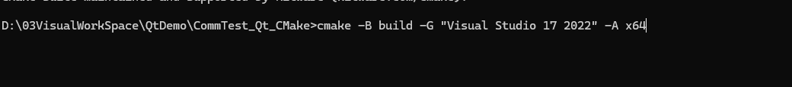


成功构建后，项目目录下将会生成build文件夹，其内容：


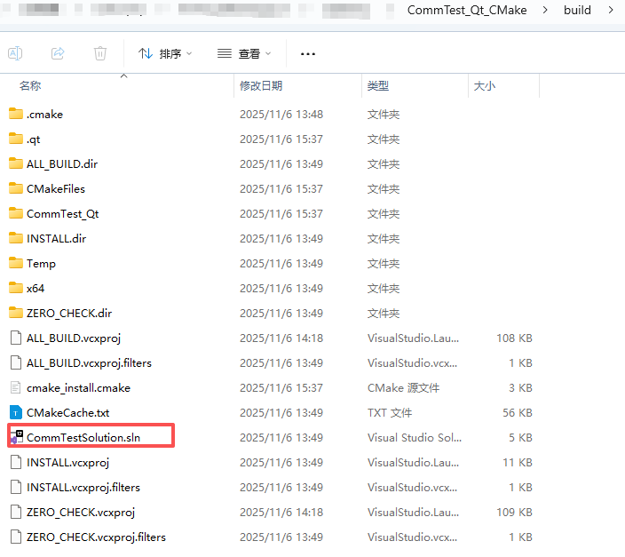

打开sln：


**至此，迁移完成。**
