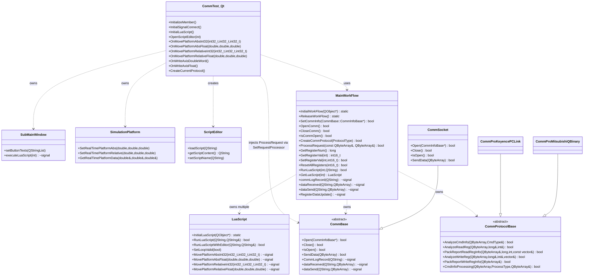
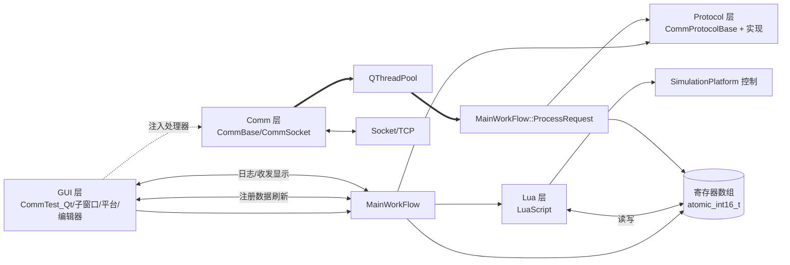

# 项目类关系梳理与 MainWorkFlow 性能优化方案

## UML 类图关系说明

## 系统组件架构图（模块交互）

## MainWorkFlow 性能瓶颈点分析
- 通信层线程池任务密集：`QThreadPool` 默认线程数为 `idealThreadCount`，在高并发多端点下可能引起上下文切换与资源竞争（Comm/CommBase.cpp:33–75）。
- 端点串行与全局并行：同一端点串行、不同端点并行的策略在热点端点场景下产生队列堆积，需要限流与优先级（Comm/CommBase.cpp:33–47）。
- 寄存器刷新开销高：`UpdateTableInfo` 整表重绘与频繁字符串格式化仍是 UI 卡顿来源（CommTest_Qt/Gui/CommTest_Qt.cpp:753–799, 1273–1668）。
- 文本日志频繁追加：大量 `append` 到 `QTextEdit` 导致 UI 阻塞（CommTest_Qt/Gui/CommTest_Qt.cpp:368–383, 389–401）。
- 原子寄存器数组：`std::atomic_int16_t[100000]` 在连续写入时存在缓存伪共享风险；跨类型组合写需要批处理优化（MainFlow/MainWorkFlow.h:95–104）。
- 超时字段未生效：`PendingRequest::timeoutMs` 未见实际检查逻辑，长耗时处理可能占用线程池（Comm/CommBase.h:61–66；Comm/CommBase.cpp:22–25）。

## 优化方案与实施步骤
- 线程池与队列调优
  - 根据端点数量与负载设定 `maxThreadCount`，避免过度并发；为热点端点加入队列长度上限与丢弃策略。
  - 启用请求超时：在 `PendingRequest` 入队时记录 `timestamp`，在执行前检查 `timeoutMs`，超时直接丢弃并打日志。
  - 增加优先级：根据端点或请求类型设置优先级队列，保证关键控制请求优先执行。
- UI 刷新节流与批量更新
  - 使用 `QAbstractTableModel + QTableView` 实现局部刷新；`QTimer` 周期性批量刷新寄存器显示。
  - 日志改为环形缓冲 + 定时批量写入；大日志文件落地，UI 仅显示最近 N 行。
- 寄存器批处理接口
  - 提供 `SetRegisterBlock(int start, gsl::span<const int16_t>)`，减少多次调用；跨类型写入合并一次提交。
- 协议解析优化
  - 在 `ProcessRequest` 中将解析与打包分离，允许缓存协议头/模板；对重复请求使用快速路径。
- Lua 与平台控制
  - 合并频繁位置更新，设置刷新周期；脚本 API 增加批量寄存器写接口。

### 关键代码参考
- 处理器注入：`CommTest_Qt/Gui/CommTest_Qt.cpp:452–455`
- 通信层线程池：`CommTest_Qt/Comm/CommBase.cpp:33–75`
- 请求处理函数：`CommTest_Qt/MainFlow/MainWorkFlow.cpp:379`

## 实施计划（分阶段）
- 阶段 1：解耦 UI 与解析线程；加入请求队列与刷新节流；验证无功能回归。
- 阶段 2：引入 TableModel；完成寄存器显示优化与批量写接口；压测日志写入。
- 阶段 3：协议与通信并发管控；Lua/平台合并更新；提供配置项与监控指标（处理耗时/队列长度/丢弃计数）。