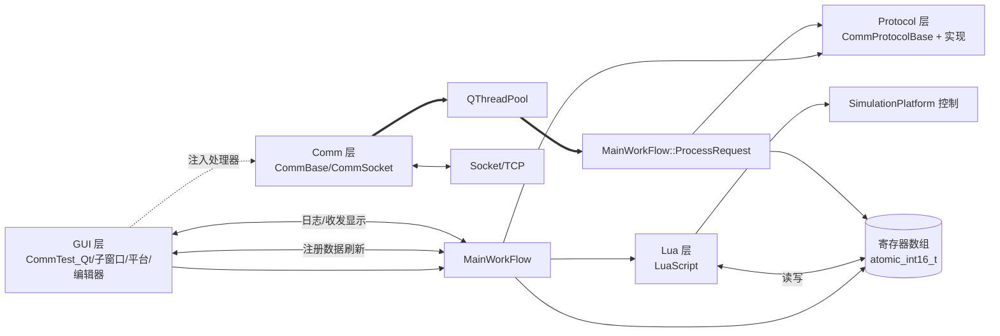
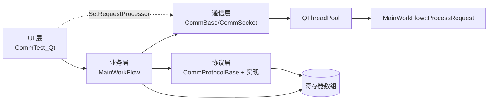
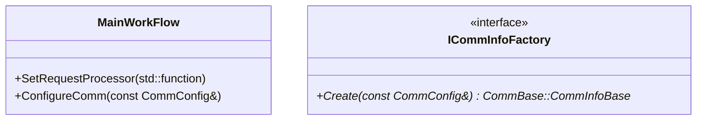

# 项目类关系梳理与 MainWorkFlow 性能优化方案

## UML 类图关系说明

## 系统组件架构图（模块交互）

## MainWorkFlow 性能瓶颈点分析
- 通信层线程池任务密集：`QThreadPool` 默认线程数为 `idealThreadCount`，在高并发多端点下可能引起上下文切换与资源竞争（Comm/CommBase.cpp:33–75）。
- 端点串行与全局并行：同一端点串行、不同端点并行的策略在热点端点场景下产生队列堆积，需要限流与优先级（Comm/CommBase.cpp:33–47）。
- 寄存器刷新开销高：`UpdateTableInfo` 整表重绘与频繁字符串格式化仍是 UI 卡顿来源（CommTest_Qt/Gui/CommTest_Qt.cpp:753–799, 1273–1668）。
- 文本日志频繁追加：大量 `append` 到 `QTextEdit` 导致 UI 阻塞（CommTest_Qt/Gui/CommTest_Qt.cpp:368–383, 389–401）。
- 原子寄存器数组：`std::atomic_int16_t[100000]` 在连续写入时存在缓存伪共享风险；跨类型组合写需要批处理优化（MainFlow/MainWorkFlow.h:95–104）。
- 超时字段未生效：`PendingRequest::timeoutMs` 未见实际检查逻辑，长耗时处理可能占用线程池（Comm/CommBase.h:61–66；Comm/CommBase.cpp:22–25）。

## 优化方案与实施步骤
- 线程池与队列调优
  - 根据端点数量与负载设定 `maxThreadCount`，避免过度并发；为热点端点加入队列长度上限与丢弃策略。
  - 启用请求超时：在 `PendingRequest` 入队时记录 `timestamp`，在执行前检查 `timeoutMs`，超时直接丢弃并打日志。
  - 增加优先级：根据端点或请求类型设置优先级队列，保证关键控制请求优先执行。
- UI 刷新节流与批量更新
  - 使用 `QAbstractTableModel + QTableView` 实现局部刷新；`QTimer` 周期性批量刷新寄存器显示。
  - 日志改为环形缓冲 + 定时批量写入；大日志文件落地，UI 仅显示最近 N 行。
- 寄存器批处理接口
  - 提供 `SetRegisterBlock(int start, gsl::span<const int16_t>)`，减少多次调用；跨类型写入合并一次提交。
- 协议解析优化
  - 在 `ProcessRequest` 中将解析与打包分离，允许缓存协议头/模板；对重复请求使用快速路径。
- Lua 与平台控制
  - 合并频繁位置更新，设置刷新周期；脚本 API 增加批量寄存器写接口。

### 关键代码参考
- 处理器注入：`CommTest_Qt/Gui/CommTest_Qt.cpp:452–455`
- 通信层线程池：`CommTest_Qt/Comm/CommBase.cpp:33–75`
- 请求处理函数：`CommTest_Qt/MainFlow/MainWorkFlow.cpp:379`

## 实施计划（分阶段）
- 阶段 1：解耦 UI 与解析线程；加入请求队列与刷新节流；验证无功能回归。
- 阶段 2：引入 TableModel；完成寄存器显示优化与批量写接口；压测日志写入。
- 阶段 3：协议与通信并发管控；Lua/平台合并更新；提供配置项与监控指标（处理耗时/队列长度/丢弃计数）。

## 层间耦合评估

### 依赖关系图

### 评估结论
- UI ↔ 业务层：UI 通过公开接口操作 `MainWorkFlow`，并订阅其信号；交互遵循职责分离（`Gui/CommTest_Qt.h:77–113；MainFlow/MainWorkFlow.h:42–69, 105–113`）。
- 业务层 ↔ 通信层：`MainWorkFlow` 持有 `CommBase*`，通过抽象接口管理打开/关闭通信与取指针（`MainFlow/MainWorkFlow.h:57–59, 95–104`）。
- 通信层 ↔ 协议层：通信层不直接依赖协议；协议解析在 `MainWorkFlow::ProcessRequest` 中完成，通信只负责排队与并发执行（`Comm/CommBase.cpp:33–75；MainFlow/MainWorkFlow.cpp:379`）。
- 注入关系：UI 将处理器注入到通信层（`SetRequestProcessor`），形成跨层穿透；但注入对象仍来自业务层（`CommTest_Qt/Gui/CommTest_Qt.cpp:448–455`）。
- 循环依赖：不存在编译期循环；依赖方向为 UI → 业务 → 通信/协议。

### 过耦合点与影响
- UI 直接构造具体通信信息类型：`CommSocket::SocketCommInfo` 在 UI 层被实例化（`Gui/CommTest_Qt.cpp:308–317`），使 UI 依赖具体通信实现；影响：更换通信方式需要修改 UI。
- UI 向通信层直接注入处理器：`SetRequestProcessor` 从 UI 触发（`Gui/CommTest_Qt.cpp:448–455`），虽然处理器来自业务层，但 UI 持有注入路径；影响：UI 与通信层产生额外关联。
- 业务层公开 `GetCommBase()`：UI 可获得通信层实例并进行操作（`MainWorkFlow.h:57–59`）；影响：提升了跨层操作可能性。

## 解耦实施方案
- 依赖注入上移到业务层
  - 在 `MainWorkFlow` 暴露 `SetRequestProcessor(std::function<bool(const QByteArray&, QByteArray&)>)`，由 UI 将处理器交给业务层，业务层再内部设置到 `CommBase`。
  - 效果：UI 不直接接触通信层实例；职责边界更清晰。
- 通信信息构造移至工厂
  - 在业务层引入 `ICommInfoFactory`，根据 UI 提供的简单配置（IP/端口/模式）生成 `CommBase::CommInfoBase` 的具体实例；UI 不再引用 `CommSocket::SocketCommInfo`。
  - 效果：UI 与具体通信类型解耦；可扩展串口等类型而不改动 UI。
- 协议选择统一入口
  - 保持 `MainWorkFlow::CreateCommProtocol(ProtocolType)` 为唯一入口；UI 仅选择枚举；业务层内部使用工厂创建具体实现。
  - 效果：UI 与协议实现完全解耦。

### 示例接口草案

## 重构优先级建议
- P1：上移处理器注入到业务层；UI 不再调用 `GetCommBase()->SetRequestProcessor`。
- P2：引入通信信息工厂；UI 仅传递配置值。
- P3：协议工厂与枚举解耦增强；保留现有入口，内部实现工厂化。
- P4：完善通信层请求超时与热点端点限流；避免线程池被占满影响系统响应。

## 质量与兼容性保证
- 保持 UI 接口不变（按钮与编辑框交互逻辑不变）；仅替换内部调用路径。
- 业务层继续作为唯一对外接口；协议与通信实现细节对 UI 隐藏。
- 增强可测试性：处理器注入与工厂化使各层易于单元测试与模拟替换。